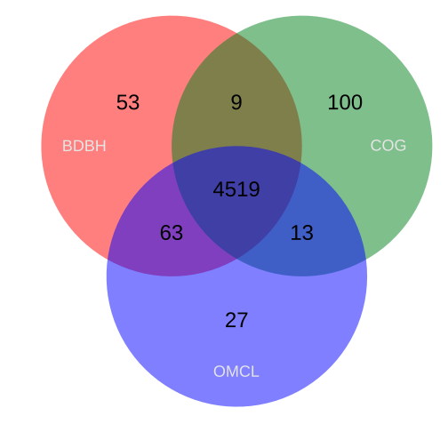
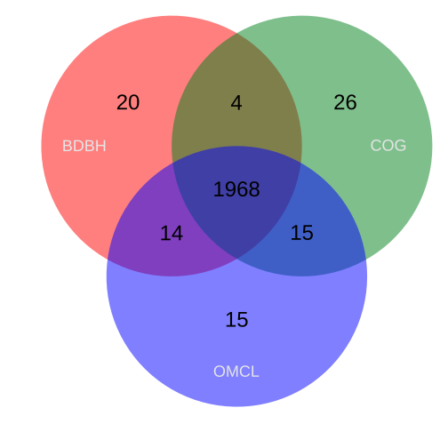

# Pangenome

Pangenome analysis

# Conectarse

~~~
ssh nombre@servidior
password
~~~
{: .language-bash}

Moverse a la carpeta

~~~
cd carpeta
~~~
{: .language-bash}

## Make blast

Concatenar archivos y correr BLAST con la opción de `prot` porque son Pangenomas.

~~~
cat Haydee/data/*.faa > all-genomes.faa
cd ~/Haydee/blast/output-blast/
makeblastdb -in ~/Haydee/data/all-genomes.faa -dbtype prot -out ~/Haydee/blast/database/all-genomes
~~~
{: .language-bash}

~~~
cat: /home/betterlab/Haydee/data/all-genomes.faa: input file is output file
Adding sequences from FASTA; added 27811 sequences in 4.72535 seconds.
~~~
{: .output}

~~~
#blastp blastp -query ~/Haydee/data/all-genomes.faa -db ~/Haydee/blast/all-genomes -outfmt "6" > all-genomes.blast
#Algunas de las posibles opciones: "6 qseqid sseqid pident length mismatch gapopen qstart qend sstart send evalue bitscore"
#Para dejar corriendo en la terminal
nohup blastp -query ~/Haydee/data/all-genomes.faa -db ~/Haydee/blast/all-genomes -outfmt "6" > all-genomes.blast &
~~~
{: .language-bash}

Copiar los archivos a local desde otra terminal.
~~~
scp servidor@servidor:/home/betterlab/Haydee/blast/all-genomes.blast .
~~~
{: .language-bash}

Default values for output:
~~~
-outfmt "6 qseqid sseqid pident length mismatch gapopen qstart qend sstart send evalue bitscore"
~~~
{: .language-bash}

  * qseqid: Query Seq-id
  * sseqid: Subject Seq-id
  * pident: Percentage of identical matches
  * length: Alignment length
  * mismatch Number of mismatches
  * gapopen: Number of gap openings
  * qstart: Start of alignment  in query
  * qend: End of alignment in query
  * sstart: Start of alignment in subject
  * send: End if alignment in subject
  * evalue: Expect value
  * bitscore: Bit score
  
Explore de dataset.

~~~
data <- read.delim("~/Pangenome/all-genomes.blast", header=FALSE)
head(data)
~~~
{: .language-bash}

~~~
                   V1                     V2      V3 V4 V5 V6 V7 V8 V9 V10      V11 V12
1 fig|2692915.4.peg.1    fig|2692915.4.peg.1 100.000 88  0  0  1 88  1  88 1.45e-62 183
2 fig|2692915.4.peg.1 fig|2692915.4.peg.7369  97.727 88  2  0  1 88  1  88 1.88e-61 180
3 fig|2692915.4.peg.1 fig|2692915.4.peg.3260  79.310 87 18  0  1 87  1  87 6.97e-47 153
4 fig|2692915.4.peg.1 fig|2692915.4.peg.1536  67.045 88 29  0  1 88  1  88 1.08e-41 132
5 fig|2692915.4.peg.1 fig|2692915.4.peg.1153  64.045 89 30  1  1 87  1  89 4.03e-39 132
6 fig|2692915.4.peg.1 fig|2692915.4.peg.5246 100.000 51  0  0  1 51  1  51 1.59e-33 108
~~~
{: .output}

# Get_homologues

Crear carpeta con todos los archivos `.faa` (o .gbk) para después si es necesario añadir más archivos.
El siguiente código corre get_homologues en todos los archivos de la carpeta con los archivos `.faa`.

~~~
(Pangenomics_Global) alumno5@betterlabub:~/Haydee$ get_homologues.pl -d data_get -c
~~~
{: .language-bash}

Se obtiene lo siguiente (tarda al rededor de 20min.).

~~~
# /opt/anaconda3/envs/Pangenomics_Global/bin/get_homologues.pl -i 0 -d data_get -o 0 -X 0 -e 0 -f 0 -r 0 -t all -c 1 -z 0 -I 0 -m local -n 2 -M 0 -G 0 -p 0 -C 75 -S 1 -E 1e-05 -F 1.5 -N 0 -B 50 -b 0 -s 0 -D 0 -g 0 -a '0' -x 0 -R 0 -A 0 -P 0

# version 28042022
# results_directory=/home/alumno5/Haydee/data_get_homologues
# parameters: MAXEVALUEBLASTSEARCH=0.01 MAXPFAMSEQS=250 BATCHSIZE=100 KEEPSCNDHSPS=1
# diamond job:0

# checking input files...
# 2692915.4.faa 8802
# 287862.3.faa 8982
# 287863.3.faa 8982

# 3 genomes, 26766 sequences

# taxa considered = 3 sequences = 26766 residues = 7168829 MIN_BITSCORE_SIM = 18.7

# mask=2692915_f0_alltaxa_algBDBH_e0_ (_algBDBH)

# running makeblastdb with /home/alumno5/Haydee/data_get_homologues/2692915.4.faa.fasta

# running makeblastdb with /home/alumno5/Haydee/data_get_homologues/287862.3.faa.fasta

# running makeblastdb with /home/alumno5/Haydee/data_get_homologues/287863.3.faa.fasta

# running BLAST searches ...
# done

# concatenating and sorting BLAST/DIAMOND results...
# sorting _2692915.4.faa results (19MB)
# sorting _287862.3.faa results (19MB)
# sorting _287863.3.faa results (19MB)
# done

# parsing blast result! (/home/alumno5/Haydee/data_get_homologues/tmp/all.blast , 56MB)
# parsing file finished

# creating indexes, this might take some time (lines=7.70e+05) ...

# construct_taxa_indexes: number of taxa found = 3
# number of file addresses/BLAST queries = 2.7e+04

# genome composition report (samples=6,permutations=6,seed=0)
# genomic composition parameters: MIN_PERSEQID_HOM=0 MIN_COVERAGE_HOM=20 (set in lib/marfil_homology.pm)
# genome order:
# 0 2692915.4.faa
# 1 287862.3.faa
# 2 287863.3.faa

## sample 0 (2692915.4.faa | 0,1,2,)
# clustering inparalogues in 2692915.4.faa
# 914 sequences
# adding 2692915.4.faa: core=8204 pan=8204
# clustering inparalogues in 287862.3.faa
# 515 sequences
# finding BDBHs between 2692915.4.faa and 287862.3.faa
# 4644 sequences
# finding homologs between 287862.3.faa and 2692915.4.faa
# 6529 sequences
# adding 287862.3.faa: core=4644 pan=10648
# clustering inparalogues in 287863.3.faa
# 515 sequences
# finding BDBHs between 2692915.4.faa and 287863.3.faa
# 4644 sequences
# finding homologs between 287863.3.faa and 287862.3.faa
# 8979 sequences
# finding homologs between 287863.3.faa and 2692915.4.faa
# 6529 sequences
# adding 287863.3.faa: core=4644 pan=10651
## sample 1 (287863.3.faa | 2,0,1,)
# clustering inparalogues in 287863.3.faa
# 515 sequences
# adding 287863.3.faa: core=8685 pan=8685
# clustering inparalogues in 2692915.4.faa
# 914 sequences
# finding BDBHs between 287863.3.faa and 2692915.4.faa
# 4644 sequences
# finding homologs between 2692915.4.faa and 287863.3.faa
# 6496 sequences
# adding 2692915.4.faa: core=4644 pan=10863
# clustering inparalogues in 287862.3.faa
# 515 sequences
# finding BDBHs between 287863.3.faa and 287862.3.faa
# 8679 sequences
# finding homologs between 287862.3.faa and 2692915.4.faa
# 6529 sequences
# finding homologs between 287862.3.faa and 287863.3.faa
# 8979 sequences
# adding 287862.3.faa: core=4644 pan=10866
## sample 2 (2692915.4.faa | 0,2,1,)
# clustering inparalogues in 2692915.4.faa
# 914 sequences
# adding 2692915.4.faa: core=8204 pan=8204
# clustering inparalogues in 287863.3.faa
# 515 sequences
# finding BDBHs between 2692915.4.faa and 287863.3.faa
# 4644 sequences
# finding homologs between 287863.3.faa and 2692915.4.faa
# 6529 sequences
# adding 287863.3.faa: core=4644 pan=10648
# clustering inparalogues in 287862.3.faa
# 515 sequences
# finding BDBHs between 2692915.4.faa and 287862.3.faa
# 4644 sequences
# finding homologs between 287862.3.faa and 287863.3.faa
# 8979 sequences
# finding homologs between 287862.3.faa and 2692915.4.faa
# 6529 sequences
# adding 287862.3.faa: core=4644 pan=10651
## sample 3 (2692915.4.faa | 0,1,2,)
# clustering inparalogues in 2692915.4.faa
# 914 sequences
# adding 2692915.4.faa: core=8204 pan=8204
# clustering inparalogues in 287862.3.faa
# 515 sequences
# finding BDBHs between 2692915.4.faa and 287862.3.faa
# 4644 sequences
# finding homologs between 287862.3.faa and 2692915.4.faa
# 6529 sequences
# adding 287862.3.faa: core=4644 pan=10648
# clustering inparalogues in 287863.3.faa
# 515 sequences
# finding BDBHs between 2692915.4.faa and 287863.3.faa
# 4644 sequences
# finding homologs between 287863.3.faa and 287862.3.faa
# 8979 sequences
# finding homologs between 287863.3.faa and 2692915.4.faa
# 6529 sequences
# adding 287863.3.faa: core=4644 pan=10651
## sample 4 (287862.3.faa | 1,0,2,)
# clustering inparalogues in 287862.3.faa
# 515 sequences
# adding 287862.3.faa: core=8685 pan=8685
# clustering inparalogues in 2692915.4.faa
# 914 sequences
# finding BDBHs between 287862.3.faa and 2692915.4.faa
# 4644 sequences
# finding homologs between 2692915.4.faa and 287862.3.faa
# 6496 sequences
# adding 2692915.4.faa: core=4644 pan=10863
# clustering inparalogues in 287863.3.faa
# 515 sequences
# finding BDBHs between 287862.3.faa and 287863.3.faa
# 8679 sequences
# finding homologs between 287863.3.faa and 2692915.4.faa
# 6529 sequences
# finding homologs between 287863.3.faa and 287862.3.faa
# 8979 sequences
# adding 287863.3.faa: core=4644 pan=10866
## sample 5 (287863.3.faa | 2,1,0,)
# clustering inparalogues in 287863.3.faa
# 515 sequences
# adding 287863.3.faa: core=8685 pan=8685
# clustering inparalogues in 287862.3.faa
# 515 sequences
# finding BDBHs between 287863.3.faa and 287862.3.faa
# 8679 sequences
# finding homologs between 287862.3.faa and 287863.3.faa
# 8979 sequences
# adding 287862.3.faa: core=8679 pan=8688
# clustering inparalogues in 2692915.4.faa
# 914 sequences
# finding BDBHs between 287863.3.faa and 2692915.4.faa
# 4644 sequences
# finding homologs between 2692915.4.faa and 287862.3.faa
# 6496 sequences
# finding homologs between 2692915.4.faa and 287863.3.faa
# 6496 sequences
# adding 2692915.4.faa: core=4644 pan=10866

# pan-genome (number of genes, can be plotted with plot_pancore_matrix.pl)
# file=data_get_homologues/pan_genome_algBDBH.tab
genomes mean    stddev  |       samples
0       8444    240     |       8204    8685    8204    8204    8685    8685
1       10393   769     |       10648   10863   10648   10648   10863   8688
2       10758   108     |       10651   10866   10651   10651   10866   10866

# core-genome (number of genes, can be plotted with plot_pancore_matrix.pl)
# file=data_get_homologues/core_genome_algBDBH.tab
genomes mean    stddev  |       samples
0       8444    240     |       8204    8685    8204    8204    8685    8685
1       5316    1504    |       4644    4644    4644    4644    4644    8679
2       4644    0       |       4644    4644    4644    4644    4644    4644

# clustering orthologous sequences

# clustering inparalogues in 2692915.4.faa (reference)
# 914 sequences

# clustering inparalogues in 287862.3.faa
# 515 sequences

# finding BDBHs between 2692915.4.faa and 287862.3.faa
# 4644 sequences

# clustering inparalogues in 287863.3.faa
# 515 sequences

# finding BDBHs between 2692915.4.faa and 287863.3.faa
# 4644 sequences

# looking for valid ORF clusters (n_of_taxa=3)...

# number_of_clusters = 4644
# cluster_list = data_get_homologues/2692915_f0_alltaxa_algBDBH_e0_.cluster_list
# cluster_directory = data_get_homologues/2692915_f0_alltaxa_algBDBH_e0_

# runtime: 1159 wallclock secs (26.93 usr  0.80 sys + 1338.43 cusr  6.07 csys = 1372.23 CPU)
# RAM use: 72.3 MB
~~~
{: .output}

Correr el siguiente:
~~~
(Pangenomics_Global) alumno5@betterlabub:~/Haydee$ get_homologues.pl -d data_get -G
~~~
{: .language-bash}

Se obtiene lo siguiente:

~~~
# /opt/anaconda3/envs/Pangenomics_Global/bin/get_homologues.pl -i 0 -d data_get -o 0 -X 0 -e 0 -f 0 -r 0 -t all -c 0 -z 0 -I 0 -m local -n 2 -M 0 -G 1 -p 0 -C 75 -S 1 -E 1e-05 -F 1.5 -N 0 -B 50 -b 0 -s 0 -D 0 -g 0 -a '0' -x 0 -R 0 -A 0 -P 0

# version 28042022
# results_directory=/home/alumno5/Haydee/data_get_homologues
# parameters: MAXEVALUEBLASTSEARCH=0.01 MAXPFAMSEQS=250 BATCHSIZE=100 KEEPSCNDHSPS=1
# diamond job:0

# checking input files...
# 2692915.4.faa 8802
# 287862.3.faa 8982
# 287863.3.faa 8982

# 3 genomes, 26766 sequences

# taxa considered = 3 sequences = 26766 residues = 7168829 MIN_BITSCORE_SIM = 18.7

# mask=2692915_f0_alltaxa_algCOG_e0_ (_algCOG)

# skipped genome parsing (data_get_homologues/tmp/selected.genomes)

# running BLAST searches ...
# done

# parsing file (COG)
# parsing file (COG) finished

# creating indexes, this might take some time (lines=7.70e+05) ...

# construct_taxa_indexes: number of taxa found = 3
# number of file addresses/BLAST queries = 2.7e+04

# clustering orthologous sequences
# checking lineage-specific expansions
# making COGs
# prunning COGs
# done

# looking for valid ORF clusters (n_of_taxa=3)...

# number_of_clusters = 4641
# cluster_list = data_get_homologues/2692915_f0_alltaxa_algCOG_e0_.cluster_list
# cluster_directory = data_get_homologues/2692915_f0_alltaxa_algCOG_e0_

# runtime: 24 wallclock secs ( 2.97 usr  0.11 sys +  6.74 cusr  1.95 csys = 11.77 CPU)
# RAM use: 67.1 MB
~~~
{: .output}

Correr el siguiente algoritmo de clustering.

~~~
(Pangenomics_Global) alumno5@betterlabub:~/Haydee$ get_homologues.pl -d data_get -M
~~~
{: .language-bash}

Da la siguiente salida.

~~~
# /opt/anaconda3/envs/Pangenomics_Global/bin/get_homologues.pl -i 0 -d data_get -o 0 -X 0 -e 0 -f 0 -r 0 -t all -c 0 -z 0 -I 0 -m local -n 2 -M 1 -G 0 -p 0 -C 75 -S 1 -E 1e-05 -F 1.5 -N 0 -B 50 -b 0 -s 0 -D 0 -g 0 -a '0' -x 0 -R 0 -A 0 -P 0

# version 28042022
# results_directory=/home/alumno5/Haydee/data_get_homologues
# parameters: MAXEVALUEBLASTSEARCH=0.01 MAXPFAMSEQS=250 BATCHSIZE=100 KEEPSCNDHSPS=1
# diamond job:0

# checking input files...
# 2692915.4.faa 8802
# 287862.3.faa 8982
# 287863.3.faa 8982

# 3 genomes, 26766 sequences

# taxa considered = 3 sequences = 26766 residues = 7168829 MIN_BITSCORE_SIM = 18.7

# mask=2692915_f0_alltaxa_algOMCL_e0_ (_algOMCL)

# skipped genome parsing (data_get_homologues/tmp/selected.genomes)

# skip BLAST searches and parsing

# WARNING: please remove/rename results directory:
# '/home/alumno5/Haydee/data_get_homologues/'
# if you change the sequences in your .gbk/.faa files or want to re-run

# creating indexes, this might take some time (lines=7.70e+05) ...

# construct_taxa_indexes: number of taxa found = 3
# number of file addresses/BLAST queries = 2.7e+04

# clustering orthologous sequences

# identifying orthologs between 2692915.4.faa and 287862.3.faa (0)
# 5608 sequences

# identifying orthologs between 2692915.4.faa and 287863.3.faa (0)
# 5608 sequences

# identifying inparalogs in 2692915.4.faa
# 914 sequences

# identifying orthologs between 287862.3.faa and 287863.3.faa (0)
# 10032 sequences

# identifying inparalogs in 287862.3.faa
# 515 sequences

# identifying inparalogs in 287863.3.faa
# 515 sequences

# running MCL (inflation=1.5) ...
# running MCL finished

# find_OMCL_clusters: parsing clusters (/home/alumno5/Haydee/data_get_homologues/tmp/all_ortho.mcl)

# looking for valid ORF clusters (n_of_taxa=3)...

# number_of_clusters = 4622
# cluster_list = data_get_homologues/2692915_f0_alltaxa_algOMCL_e0_.cluster_list
# cluster_directory = data_get_homologues/2692915_f0_alltaxa_algOMCL_e0_

# runtime:  7 wallclock secs ( 4.22 usr  0.17 sys +  1.24 cusr  0.62 csys =  6.25 CPU)
# RAM use: 85.3 MB
~~~
{: .output}

Observar que da diferente número de clusters.

Para listar los genomas de referencia
~~~
(Pangenomics_Global) alumno5@betterlabub:~/Haydee$ ls -d data_get_homologues/*alltaxa*
~~~
{: .language-bash}

~~~
data_get_homologues/2692915_f0_alltaxa_algBDBH_e0_
data_get_homologues/2692915_f0_alltaxa_algBDBH_e0_.cluster_list
data_get_homologues/2692915_f0_alltaxa_algCOG_e0_
data_get_homologues/2692915_f0_alltaxa_algCOG_e0_.cluster_list
data_get_homologues/2692915_f0_alltaxa_algOMCL_e0_
data_get_homologues/2692915_f0_alltaxa_algOMCL_e0_.cluster_list
~~~
{: .output}

Obtener la intersección entre los clusters.

~~~
(Pangenomics_Global) alumno5@betterlabub:~/Haydee$ compare_clusters.pl -o alg_intersection -d \
data_get_homologues/2692915_f0_alltaxa_algBDBH_e0_,\
data_get_homologues/2692915_f0_alltaxa_algCOG_e0_,\
data_get_homologues/2692915_f0_alltaxa_algOMCL_e0_
~~~
{: .language-bash}

~~~
# /opt/anaconda3/envs/Pangenomics_Global/bin/compare_clusters.pl -d data_get_homologues/2692915_f0_alltaxa_algBDBH_e0_,data_get_homologues/2692915_f0_alltaxa_algCOG_e0_,data_get_homologues/2692915_f0_alltaxa_algOMCL_e0_ -o alg_intersection -n 0 -m 0 -t 0 -I  -r 0 -s 0 -x 0 -T 0

# output directory: alg_intersection

# number of input cluster directories = 3

# parsing clusters in data_get_homologues/2692915_f0_alltaxa_algBDBH_e0_ ...
# cluster_list in place, will parse it (data_get_homologues/2692915_f0_alltaxa_algBDBH_e0_.cluster_list)
# number of clusters = 4644 duplicated = 0
# parsing clusters in data_get_homologues/2692915_f0_alltaxa_algCOG_e0_ ...
# cluster_list in place, will parse it (data_get_homologues/2692915_f0_alltaxa_algCOG_e0_.cluster_list)
# number of clusters = 4641 duplicated = 0
# parsing clusters in data_get_homologues/2692915_f0_alltaxa_algOMCL_e0_ ...
# cluster_list in place, will parse it (data_get_homologues/2692915_f0_alltaxa_algOMCL_e0_.cluster_list)
# number of clusters = 4622 duplicated = 0

# duplicated list: alg_intersection/duplicated.cluster_list (please review)

# intersection size = 4519 clusters

# intersection list = alg_intersection/intersection_t0.cluster_list

# input set: alg_intersection/2692915_f0_alltaxa_algBDBH_e0_.venn_t0.txt
# input set: alg_intersection/2692915_f0_alltaxa_algCOG_e0_.venn_t0.txt
# input set: alg_intersection/2692915_f0_alltaxa_algOMCL_e0_.venn_t0.txt

# Venn diagram = alg_intersection/venn_t0.pdf alg_intersection/venn_t0.svg
# Venn region file: alg_intersection/unique_2692915_f0_alltaxa_algBDBH_e0_.venn_t0.txt (53)
# Venn region file: alg_intersection/unique_2692915_f0_alltaxa_algCOG_e0_.venn_t0.txt (100)
# Venn region file: alg_intersection/unique_2692915_f0_alltaxa_algOMCL_e0_.venn_t0.txt (27)
# Venn region file: alg_intersection/intersection_2692915_f0_alltaxa_algBDBH_e0__2692915_f0_alltaxa_algCOG_e0_.venn_t0.txt (9)
# Venn region file: alg_intersection/intersection_2692915_f0_alltaxa_algBDBH_e0__2692915_f0_alltaxa_algOMCL_e0_.venn_t0.txt (63)
# Venn region file: alg_intersection/intersection_2692915_f0_alltaxa_algCOG_e0__2692915_f0_alltaxa_algOMCL_e0_.venn_t0.txt (13)
~~~
{: .output}

En el diagrama de Venn se puede observar los genes que están en el core (4519).

---

# Obtener la matriz de Pangenoma

~~~
(Pangenomics_Global) alumno5@betterlabub:~/Haydee$ get_homologues.pl -d data_get -t 0 -M
~~~
{: .language-bash}

Salida:

~~~
# /opt/anaconda3/envs/Pangenomics_Global/bin/get_homologues.pl -i 0 -d data_get -o 0 -X 0 -e 0 -f 0 -r 0 -t 0 -c 0 -z 0 -I 0 -m local -n 2 -M 1 -G 0 -p 0 -C 75 -S 1 -E 1e-05 -F 1.5 -N 0 -B 50 -b 0 -s 0 -D 0 -g 0 -a '0' -x 0 -R 0 -A 0 -P 0

# version 28042022
# results_directory=/home/alumno5/Haydee/data_get_homologues
# parameters: MAXEVALUEBLASTSEARCH=0.01 MAXPFAMSEQS=250 BATCHSIZE=100 KEEPSCNDHSPS=1
# diamond job:0

# checking input files...
# 2692915.4.faa 8802
# 287862.3.faa 8982
# 287863.3.faa 8982

# 3 genomes, 26766 sequences

# taxa considered = 3 sequences = 26766 residues = 7168829 MIN_BITSCORE_SIM = 18.7

# mask=2692915_f0_0taxa_algOMCL_e0_ (_algOMCL)

# skipped genome parsing (data_get_homologues/tmp/selected.genomes)

# skip BLAST searches and parsing

# WARNING: please remove/rename results directory:
# '/home/alumno5/Haydee/data_get_homologues/'
# if you change the sequences in your .gbk/.faa files or want to re-run

# creating indexes, this might take some time (lines=7.70e+05) ...

# construct_taxa_indexes: number of taxa found = 3
# number of file addresses/BLAST queries = 2.7e+04

# clustering orthologous sequences
# find_OMCL_clusters: re-using previous results (same parameters)

# find_OMCL_clusters: parsing clusters (/home/alumno5/Haydee/data_get_homologues/tmp/all_ortho.mcl)

# add_unmatched_singletons : 3393 sequences, 3 taxa

# looking for valid ORF clusters (n_of_taxa=0)...

# number_of_clusters = 12233
# cluster_list = data_get_homologues/2692915_f0_0taxa_algOMCL_e0_.cluster_list
# cluster_directory = data_get_homologues/2692915_f0_0taxa_algOMCL_e0_

# runtime:  5 wallclock secs ( 2.74 usr  0.21 sys +  0.31 cusr  0.02 csys =  3.28 CPU)
# RAM use: 54.5 MB
~~~
{: .output}

Segundo algoritmo

~~~
(Pangenomics_Global) alumno5@betterlabub:~/Haydee$ get_homologues.pl -d data_get -t 0 -M
~~~
{: .language-bash}

Salida

~~~
# /opt/anaconda3/envs/Pangenomics_Global/bin/get_homologues.pl -i 0 -d data_get -o 0 -X 0 -e 0 -f 0 -r 0 -t 0 -c 0 -z 0 -I 0 -m local -n 2 -M 1 -G 0 -p 0 -C 75 -S 1 -E 1e-05 -F 1.5 -N 0 -B 50 -b 0 -s 0 -D 0 -g 0 -a '0' -x 0 -R 0 -A 0 -P 0

# version 28042022
# results_directory=/home/alumno5/Haydee/data_get_homologues
# parameters: MAXEVALUEBLASTSEARCH=0.01 MAXPFAMSEQS=250 BATCHSIZE=100 KEEPSCNDHSPS=1
# diamond job:0

# checking input files...
# 2692915.4.faa 8802
# 287862.3.faa 8982
# 287863.3.faa 8982

# 3 genomes, 26766 sequences

# taxa considered = 3 sequences = 26766 residues = 7168829 MIN_BITSCORE_SIM = 18.7

# mask=2692915_f0_0taxa_algOMCL_e0_ (_algOMCL)

# skipped genome parsing (data_get_homologues/tmp/selected.genomes)

# skip BLAST searches and parsing

# WARNING: please remove/rename results directory:
# '/home/alumno5/Haydee/data_get_homologues/'
# if you change the sequences in your .gbk/.faa files or want to re-run

# creating indexes, this might take some time (lines=7.70e+05) ...

# construct_taxa_indexes: number of taxa found = 3
# number of file addresses/BLAST queries = 2.7e+04

# clustering orthologous sequences
# find_OMCL_clusters: re-using previous results (same parameters)

# find_OMCL_clusters: parsing clusters (/home/alumno5/Haydee/data_get_homologues/tmp/all_ortho.mcl)

# add_unmatched_singletons : 3393 sequences, 3 taxa

# looking for valid ORF clusters (n_of_taxa=0)...

# number_of_clusters = 12233
# cluster_list = data_get_homologues/2692915_f0_0taxa_algOMCL_e0_.cluster_list
# cluster_directory = data_get_homologues/2692915_f0_0taxa_algOMCL_e0_

# runtime:  5 wallclock secs ( 2.74 usr  0.21 sys +  0.31 cusr  0.02 csys =  3.28 CPU)
# RAM use: 54.5 MB
~~~
{: .output}

Lista de cluster directorios de COG y OMCL

~~~
(Pangenomics_Global) alumno5@betterlabub:~/Haydee$ ls -d data_get_homologues/*0taxa*
~~~
{: .language-bash}

Directorios:

~~~
data_get_homologues/2692915_f0_0taxa_algCOG_e0_
data_get_homologues/2692915_f0_0taxa_algOMCL_e0_
~~~
{: .output}

~~~
compare_clusters.pl -o alg_intersection -m -T -d \
data_get_homologues/2692915_f0_0taxa_algCOG_e0_,\
data_get_homologues/2692915_f0_0taxa_algOMCL_e0_
~~~
{: .language-bash}

Salida (revisar)

~~~
# /opt/anaconda3/envs/Pangenomics_Global/bin/compare_clusters.pl -d data_get_homologues/2692915_f0_0taxa_algCOG_e0_,data_get_homologues/2692915_f0_0taxa_algOMCL_e0_ -o alg_intersection -n 0 -m 1 -t 0 -I  -r 0 -s 0 -x 0 -T 1

# output directory: alg_intersection
# WARNING: output directory alg_intersection already exists, note that you might be mixing clusters from previous runs

# number of input cluster directories = 2

# parsing clusters in data_get_homologues/2692915_f0_0taxa_algCOG_e0_ ...
# cluster_list in place, will parse it (data_get_homologues/2692915_f0_0taxa_algCOG_e0_.cluster_list)
# WARNING: cluster 9113_fig-287862.3.peg.2940.faa duplicates 8962_fig-287862.3.peg.3636.faa
# WARNING: cluster 11014_fig-287862.3.peg.3798.faa duplicates 10499_fig-287862.3.peg.3259.faa
# WARNING: cluster 12285_fig-287862.3.peg.5187.faa duplicates 10499_fig-287862.3.peg.3259.faa
# WARNING: cluster 13279_fig-287862.3.peg.6426.faa duplicates 10499_fig-287862.3.peg.3259.faa
# WARNING: cluster 13396_fig-287862.3.peg.6543.faa duplicates 13193_fig-287862.3.peg.6279.faa
# WARNING: cluster 14075_fig-287862.3.peg.7261.faa duplicates 13193_fig-287862.3.peg.6279.faa
# WARNING: cluster 15342_fig-287862.3.peg.8131.faa duplicates 12776_fig-287862.3.peg.5746.faa
# WARNING: cluster 15444_fig-287862.3.peg.8233.faa duplicates 10499_fig-287862.3.peg.3259.faa
# WARNING: cluster 16549_fig-287862.3.peg.8694.faa duplicates 13193_fig-287862.3.peg.6279.faa
# WARNING: cluster 19255_fig-287862.3.peg.3033.faa duplicates 10273_fig-287862.3.peg.3033.faa
# WARNING: cluster 19481_fig-287862.3.peg.3259.faa duplicates 10499_fig-287862.3.peg.3259.faa
# WARNING: cluster 19996_fig-287862.3.peg.3798.faa duplicates 10499_fig-287862.3.peg.3259.faa
# WARNING: cluster 21267_fig-287862.3.peg.5187.faa duplicates 10499_fig-287862.3.peg.3259.faa
# WARNING: cluster 21758_fig-287862.3.peg.5746.faa duplicates 12776_fig-287862.3.peg.5746.faa
# WARNING: cluster 22175_fig-287862.3.peg.6279.faa duplicates 13193_fig-287862.3.peg.6279.faa
# WARNING: cluster 22261_fig-287862.3.peg.6426.faa duplicates 10499_fig-287862.3.peg.3259.faa
# WARNING: cluster 22378_fig-287862.3.peg.6543.faa duplicates 13193_fig-287862.3.peg.6279.faa
# WARNING: cluster 23057_fig-287862.3.peg.7261.faa duplicates 13193_fig-287862.3.peg.6279.faa
# WARNING: cluster 23500_fig-287862.3.peg.7704.faa duplicates 14518_fig-287862.3.peg.7704.faa
# WARNING: cluster 24324_fig-287862.3.peg.8131.faa duplicates 12776_fig-287862.3.peg.5746.faa
# WARNING: cluster 24426_fig-287862.3.peg.8233.faa duplicates 10499_fig-287862.3.peg.3259.faa
# WARNING: cluster 25531_fig-287862.3.peg.8694.faa duplicates 13193_fig-287862.3.peg.6279.faa
# WARNING: cluster 26163_fig-287862.3.peg.1549.faa duplicates 17181_fig-287862.3.peg.1549.faa
# number of clusters = 11925 duplicated = 30
# parsing clusters in data_get_homologues/2692915_f0_0taxa_algOMCL_e0_ ...
# cluster_list in place, will parse it (data_get_homologues/2692915_f0_0taxa_algOMCL_e0_.cluster_list)
# WARNING: cluster 9113_fig-287862.3.peg.2940.faa duplicates 8962_fig-287862.3.peg.3636.faa
# WARNING: cluster 13396_fig-287862.3.peg.6543.faa duplicates 13193_fig-287862.3.peg.6279.faa
# WARNING: cluster 14075_fig-287862.3.peg.7261.faa duplicates 13193_fig-287862.3.peg.6279.faa
# WARNING: cluster 15342_fig-287862.3.peg.8131.faa duplicates 12776_fig-287862.3.peg.5746.faa
# WARNING: cluster 16549_fig-287862.3.peg.8694.faa duplicates 13193_fig-287862.3.peg.6279.faa
# WARNING: cluster 19255_fig-287862.3.peg.3033.faa duplicates 10273_fig-287862.3.peg.3033.faa
# WARNING: cluster 20785_fig-287862.3.peg.4705.faa duplicates 11803_fig-287862.3.peg.4705.faa
# WARNING: cluster 21758_fig-287862.3.peg.5746.faa duplicates 12776_fig-287862.3.peg.5746.faa
# WARNING: cluster 22175_fig-287862.3.peg.6279.faa duplicates 13193_fig-287862.3.peg.6279.faa
# WARNING: cluster 22378_fig-287862.3.peg.6543.faa duplicates 13193_fig-287862.3.peg.6279.faa
# WARNING: cluster 23057_fig-287862.3.peg.7261.faa duplicates 13193_fig-287862.3.peg.6279.faa
# WARNING: cluster 23500_fig-287862.3.peg.7704.faa duplicates 14518_fig-287862.3.peg.7704.faa
# WARNING: cluster 24324_fig-287862.3.peg.8131.faa duplicates 12776_fig-287862.3.peg.5746.faa
# WARNING: cluster 25531_fig-287862.3.peg.8694.faa duplicates 13193_fig-287862.3.peg.6279.faa
# WARNING: cluster 26163_fig-287862.3.peg.1549.faa duplicates 17181_fig-287862.3.peg.1549.faa
# number of clusters = 12211 duplicated = 22

# duplicated list: alg_intersection/duplicated.cluster_list (please review)

# intersection size = 11620 clusters

# intersection list = alg_intersection/intersection_t0.cluster_list

# pangenome_file = alg_intersection/pangenome_matrix_t0.tab transposed = alg_intersection/pangenome_matrix_t0.tr.tab
# pangenome_genes = alg_intersection/pangenome_matrix_genes_t0.tab transposed = alg_intersection/pangenome_matrix_genes_t0.tr.tab
# pangenome_phylip file = alg_intersection/pangenome_matrix_t0.phylip
# pangenome_FASTA file = alg_intersection/pangenome_matrix_t0.fasta
# pangenome CSV file (Scoary) = alg_intersection/pangenome_matrix_t0.tr.csv

# parsimony results by PARS (PHYLIP suite, http://evolution.genetics.washington.edu/phylip/doc/pars.html):
# pangenome_phylip tree = alg_intersection/pangenome_matrix_t0.phylip.ph
# pangenome_phylip log = alg_intersection/pangenome_matrix_t0.phylip.log

# input set: alg_intersection/2692915_f0_0taxa_algCOG_e0_.venn_t0.txt
# input set: alg_intersection/2692915_f0_0taxa_algOMCL_e0_.venn_t0.txt

# Venn diagram = alg_intersection/venn_t0.pdf alg_intersection/venn_t0.svg
# Venn region file: alg_intersection/unique_2692915_f0_0taxa_algCOG_e0_.venn_t0.txt (305)
# Venn region file: alg_intersection/unique_2692915_f0_0taxa_algOMCL_e0_.venn_t0.txt (591)
~~~
{: .output}

#Plot core y Pangenome cluster del algoritmo BDBH

~~~
(Pangenomics_Global) alumno5@betterlabub:~/Haydee$ plot_pancore_matrix.pl -i data_get_homologues/pan_genome_algBDBH.tab 
~~~
{: .language-bash}

~~~
# /opt/anaconda3/envs/Pangenomics_Global/bin/plot_pancore_matrix.pl -i data_get_homologues/pan_genome_algBDBH.tab -f core_Tettelin -F 0.80 -a 
# outfiles: data_get_homologues/pan_genome_algBDBH.tab_core_Tettelin.log , data_get_homologues/pan_genome_algBDBH.tab_core_Tettelin.png , data_get_homologues/pan_genome_algBDBH.tab_core_Tettelin.pdf , data_get_homologues/pan_genome_algBDBH.tab_core_Tettelin.svg
~~~
{: .output}

No se pude hacer este análisis.
~~~
(Pangenomics_Global) alumno5@betterlabub:~/Haydee$ parse_pangenome_matrix.pl -m alg_intersection/pangenome_matrix_t0.tab -s
~~~
{: .language-bash}

~~~
# /opt/anaconda3/envs/Pangenomics_Global/bin/parse_pangenome_matrix.pl -m alg_intersection/pangenome_matrix_t0.tab -I  -A  -B  -a 0 -g 0 -e 0 -p  -s 1 -n 0 -l 0 -x 0 -P 100 -S 0

# matrix contains 11620 clusters and 3 taxa

# EXIT : need at least 5 taxa to perform -s analysis
~~~
{: .output}

# Clavibacter

Hacer links simbólicos
~~~
find ~/get_homologues/sample_buch_fasta/. -name "*.faa" -exec ln -s {} . ';'
~~~
{: .language-bash}

Tiempo aproximado 5hr con 2 genomas de cada subespecie

correr el segundo get_homologues.pl

~~~
~/get_homologues/sim2_g$ get_homologues.pl -d data_get -G
~~~
{: .language-bash}

Resultado
~~~
# version 28042022
# results_directory=/home/haydee/get_homologues/sim2_g/data_get_homologues
# parameters: MAXEVALUEBLASTSEARCH=0.01 MAXPFAMSEQS=250 BATCHSIZE=100 KEEPSCNDHSPS=1
# diamond job:0

# checking input files...
# 1097677.33.faa 2904
# 1874630.22.faa 2902
# 1874630.26.faa 2871
# 31963.54.faa 2920
# 31963.56.faa 2892
# 31964.81.faa 3229
# 31964.84.faa 3226
# 31965.20.faa 3058
# 31965.24.faa 3148
# 33014.40.faa 3106
# 33014.42.faa 3136
# 443906.110.faa 3168

# 12 genomes, 36560 sequences

# taxa considered = 12 sequences = 36560 residues = 11513173 MIN_BITSCORE_SIM = 19.2

# mask=1874630_f0_alltaxa_algCOG_e0_ (_algCOG)

# skipped genome parsing (data_get_homologues/tmp/selected.genomes)

# running BLAST searches ...
# done

# parsing file (COG)
# parsing file (COG) finished

# creating indexes, this might take some time (lines=1.74e+06) ...

# construct_taxa_indexes: number of taxa found = 12
# number of file addresses/BLAST queries = 3.7e+04

# clustering orthologous sequences
# checking lineage-specific expansions
# making COGs
# prunning COGs
# done

# looking for valid ORF clusters (n_of_taxa=12)...

# number_of_clusters = 2013
# cluster_list = data_get_homologues/1874630_f0_alltaxa_algCOG_e0_.cluster_list
# cluster_directory = data_get_homologues/1874630_f0_alltaxa_algCOG_e0_

# runtime: 39 wallclock secs ( 5.18 usr  0.14 sys + 13.24 cusr  3.83 csys = 22.39 CPU)
# RAM use: 78.2 MB
~~~
{: .output}

Tercer get_homologues.

~~~
~/get_homologues/sim2_g$ get_homologues.pl -d data_get -M
~~~
{: .language-bash}

Resultado

~~~
...
# identifying inparalogs in 443906.110.faa
# 36 sequences

# running MCL (inflation=1.5) ...
# running MCL finished

# find_OMCL_clusters: parsing clusters (/home/haydee/get_homologues/sim2_g/data_get_homologues/tmp/all_ortho.mcl)

# looking for valid ORF clusters (n_of_taxa=12)...

# number_of_clusters = 2012
# cluster_list = data_get_homologues/1874630_f0_alltaxa_algOMCL_e0_.cluster_list
# cluster_directory = data_get_homologues/1874630_f0_alltaxa_algOMCL_e0_

# runtime: 37 wallclock secs (32.59 usr  0.64 sys +  1.24 cusr  1.03 csys = 35.50 CPU)
# RAM use: 128.4 MB
~~~
{: .output}

Para listar los genomas de referencia
~~~
(Pangenomics_Global) alumno5@betterlabub:~/Haydee$ ls -d data_get_homologues/*alltaxa*
~~~
{: .language-bash}

~~~
data_get_homologues//1874630_f0_alltaxa_algBDBH_e0_
data_get_homologues//1874630_f0_alltaxa_algBDBH_e0_.cluster_list
data_get_homologues//1874630_f0_alltaxa_algCOG_e0_
data_get_homologues//1874630_f0_alltaxa_algCOG_e0_.cluster_list
data_get_homologues//1874630_f0_alltaxa_algOMCL_e0_
data_get_homologues//1874630_f0_alltaxa_algOMCL_e0_.cluster_list
~~~
{: .output}

Obtener la intersección entre los clusters.

~~~
(Pangenomics_Global) alumno5@betterlabub:~/Haydee$ compare_clusters.pl -o alg_intersection -d \
data_get_homologues//1874630_f0_alltaxa_algBDBH_e0_,\
data_get_homologues//1874630_f0_alltaxa_algCOG_e0_,\
data_get_homologues//1874630_f0_alltaxa_algOMCL_e0_
~~~
{: .language-bash}

Resultado

~~~
# output directory: alg_intersection

# number of input cluster directories = 3

# parsing clusters in data_get_homologues/1874630_f0_alltaxa_algBDBH_e0_ ...
# cluster_list in place, will parse it (data_get_homologues/1874630_f0_alltaxa_algBDBH_e0_.cluster_list)
# number of clusters = 2006 duplicated = 0
# parsing clusters in data_get_homologues/1874630_f0_alltaxa_algCOG_e0_ ...
# cluster_list in place, will parse it (data_get_homologues/1874630_f0_alltaxa_algCOG_e0_.cluster_list)
# number of clusters = 2013 duplicated = 0
# parsing clusters in data_get_homologues/1874630_f0_alltaxa_algOMCL_e0_ ...
# cluster_list in place, will parse it (data_get_homologues/1874630_f0_alltaxa_algOMCL_e0_.cluster_list)
# number of clusters = 2012 duplicated = 0

# duplicated list: alg_intersection/duplicated.cluster_list (please review)

# intersection size = 1968 clusters

# intersection list = alg_intersection/intersection_t0.cluster_list

# input set: alg_intersection/1874630_f0_alltaxa_algBDBH_e0_.venn_t0.txt
# input set: alg_intersection/1874630_f0_alltaxa_algCOG_e0_.venn_t0.txt
# input set: alg_intersection/1874630_f0_alltaxa_algOMCL_e0_.venn_t0.txt

# Venn diagram = alg_intersection/venn_t0.pdf alg_intersection/venn_t0.svg
# Venn region file: alg_intersection/unique_1874630_f0_alltaxa_algBDBH_e0_.venn_t0.txt (20)
# Venn region file: alg_intersection/unique_1874630_f0_alltaxa_algCOG_e0_.venn_t0.txt (26)
# Venn region file: alg_intersection/unique_1874630_f0_alltaxa_algOMCL_e0_.venn_t0.txt (15)
# Venn region file: alg_intersection/intersection_1874630_f0_alltaxa_algBDBH_e0__1874630_f0_alltaxa_algCOG_e0_.venn_t0.txt (4)
# Venn region file: alg_intersection/intersection_1874630_f0_alltaxa_algBDBH_e0__1874630_f0_alltaxa_algOMCL_e0_.venn_t0.txt (14)
# Venn region file: alg_intersection/intersection_1874630_f0_alltaxa_algCOG_e0__1874630_f0_alltaxa_algOMCL_e0_.venn_t0.txt (15)
~~~
{: .output}

En el diagrama de Venn se puede observar los genes que están en el core (4519).

---

# Obtener la matriz de Pangenoma

~~~
(Pangenomics_Global) alumno5@betterlabub:~/Haydee$ get_homologues.pl -d data_get -t 0 -M
~~~
{: .language-bash}

Salida:

~~~
# version 28042022
# results_directory=/home/haydee/get_homologues/sim2_g/data_get_homologues
# parameters: MAXEVALUEBLASTSEARCH=0.01 MAXPFAMSEQS=250 BATCHSIZE=100 KEEPSCNDHSPS=1
# diamond job:0

# checking input files...
# 1097677.33.faa 2904
# 1874630.22.faa 2902
# 1874630.26.faa 2871
# 31963.54.faa 2920
# 31963.56.faa 2892
# 31964.81.faa 3229
# 31964.84.faa 3226
# 31965.20.faa 3058
# 31965.24.faa 3148
# 33014.40.faa 3106
# 33014.42.faa 3136
# 443906.110.faa 3168

# 12 genomes, 36560 sequences

# taxa considered = 12 sequences = 36560 residues = 11513173 MIN_BITSCORE_SIM = 19.2

# mask=1874630_f0_0taxa_algOMCL_e0_ (_algOMCL)

# skipped genome parsing (data_get_homologues/tmp/selected.genomes)

# skip BLAST searches and parsing

# WARNING: please remove/rename results directory:
# '/home/haydee/get_homologues/sim2_g/data_get_homologues/'
# if you change the sequences in your .gbk/.faa files or want to re-run

# creating indexes, this might take some time (lines=1.74e+06) ...

# construct_taxa_indexes: number of taxa found = 12
# number of file addresses/BLAST queries = 3.7e+04

# clustering orthologous sequences
# find_OMCL_clusters: re-using previous results (same parameters)

# find_OMCL_clusters: parsing clusters (/home/haydee/get_homologues/sim2_g/data_get_homologues/tmp/all_ortho.mcl)

# add_unmatched_singletons : 1241 sequences, 12 taxa

# looking for valid ORF clusters (n_of_taxa=0)...

# number_of_clusters = 5780
# cluster_list = data_get_homologues/1874630_f0_0taxa_algOMCL_e0_.cluster_list
# cluster_directory = data_get_homologues/1874630_f0_0taxa_algOMCL_e0_

# runtime: 11 wallclock secs ( 5.83 usr  0.16 sys +  0.31 cusr  0.03 csys =  6.33 CPU)
# RAM use: 61.8 MB

~~~
{: .output}

Segundo algoritmo

~~~
(Pangenomics_Global) alumno5@betterlabub:~/Haydee$ get_homologues.pl -d data_get -t 0 -G
~~~
{: .language-bash}

Salida

~~~
# /opt/anaconda3/envs/Pangenomics_Global/bin/get_homologues.pl -i 0 -d data_get -o 0 -X 0 -e 0 -f 0 -r 0 -t 0 -c 0 -z 0 -I 0 -m local -n 2 -M 0 -G 1 -p 0 -C 75 -S 1 -E 1e-05 -F 1.5 -N 0 -B 50 -b 0 -s 0 -D 0 -g 0 -a '0' -x 0 -R 0 -A 0 -P 0

# version 28042022
# results_directory=/home/haydee/get_homologues/sim2_g/data_get_homologues
# parameters: MAXEVALUEBLASTSEARCH=0.01 MAXPFAMSEQS=250 BATCHSIZE=100 KEEPSCNDHSPS=1
# diamond job:0

# checking input files...
# 1097677.33.faa 2904
# 1874630.22.faa 2902
# 1874630.26.faa 2871
# 31963.54.faa 2920
# 31963.56.faa 2892
# 31964.81.faa 3229
# 31964.84.faa 3226
# 31965.20.faa 3058
# 31965.24.faa 3148
# 33014.40.faa 3106
# 33014.42.faa 3136
# 443906.110.faa 3168

# 12 genomes, 36560 sequences

# taxa considered = 12 sequences = 36560 residues = 11513173 MIN_BITSCORE_SIM = 19.2

# mask=1874630_f0_0taxa_algCOG_e0_ (_algCOG)

# skipped genome parsing (data_get_homologues/tmp/selected.genomes)

# skip BLAST searches and parsing

# WARNING: please remove/rename results directory:
# '/home/haydee/get_homologues/sim2_g/data_get_homologues/'
# if you change the sequences in your .gbk/.faa files or want to re-run

# creating indexes, this might take some time (lines=1.74e+06) ...

# construct_taxa_indexes: number of taxa found = 12
# number of file addresses/BLAST queries = 3.7e+04

# clustering orthologous sequences
# prunning COGs
# done

# add_unmatched_singletons : 14 sequences, 5 taxa

# looking for valid ORF clusters (n_of_taxa=0)...

# number_of_clusters = 5838
# cluster_list = data_get_homologues/1874630_f0_0taxa_algCOG_e0_.cluster_list
# cluster_directory = data_get_homologues/1874630_f0_0taxa_algCOG_e0_

# runtime:  8 wallclock secs ( 6.35 usr  0.19 sys +  0.32 cusr  0.04 csys =  6.90 CPU)
# RAM use: 78.4 MB
~~~
{: .output}

**Revisar, puse sample_intersection....**
~~~
compare_clusters.pl -o alg_intersection -m -d \
data_get_homologues/1874630_f0_0taxa_algCOG_e0_
~~~
{: .language-bash}

~~~
# /opt/anaconda3/envs/Pangenomics_Global/bin/compare_clusters.pl -d data_get_homologues/1874630_f0_0taxa_algCOG_e0_ -o alg_intersection -n 0 -m 1 -t 0 -I  -r 0 -s 0 -x 0 -T 0

# output directory: alg_intersection
# WARNING: output directory alg_intersection already exists, note that you might be mixing clusters from previous runs

# number of input cluster directories = 1

# parsing clusters in data_get_homologues/1874630_f0_0taxa_algCOG_e0_ ...
# cluster_list in place, will parse it (data_get_homologues/1874630_f0_0taxa_algCOG_e0_.cluster_list)
# number of clusters = 5838 duplicated = 0

# duplicated list: alg_intersection/duplicated.cluster_list (please review)

# intersection size = 5838 clusters

# intersection list = alg_intersection/intersection_t0.cluster_list

# pangenome_file = alg_intersection/pangenome_matrix_t0.tab transposed = alg_intersection/pangenome_matrix_t0.tr.tab
# pangenome_genes = alg_intersection/pangenome_matrix_genes_t0.tab transposed = alg_intersection/pangenome_matrix_genes_t0.tr.tab
# pangenome_phylip file = alg_intersection/pangenome_matrix_t0.phylip
# pangenome_FASTA file = alg_intersection/pangenome_matrix_t0.fasta
# pangenome CSV file (Scoary) = alg_intersection/pangenome_matrix_t0.tr.csv

# WARNING: Venn diagrams are only available for 2 or 3 input cluster directories
~~~
{: .output}

Revisar:
~~~
# /opt/anaconda3/envs/Pangenomics_Global/bin/compare_clusters.pl -d data_get_homologues/1874630_f0_0taxa_algCOG_e0_ -o sample_intersection -n 0 -m 1 -t 0 -I  -r 0 -s 0 -x 0 -T 0

# output directory: sample_intersection

# number of input cluster directories = 1

# parsing clusters in data_get_homologues/1874630_f0_0taxa_algCOG_e0_ ...
# cluster_list in place, will parse it (data_get_homologues/1874630_f0_0taxa_algCOG_e0_.cluster_list)
# number of clusters = 5838 duplicated = 0

# duplicated list: sample_intersection/duplicated.cluster_list (please review)

# intersection size = 5838 clusters

# intersection list = sample_intersection/intersection_t0.cluster_list

# pangenome_file = sample_intersection/pangenome_matrix_t0.tab transposed = sample_intersection/pangenome_matrix_t0.tr.tab
# pangenome_genes = sample_intersection/pangenome_matrix_genes_t0.tab transposed = sample_intersection/pangenome_matrix_genes_t0.tr.tab
# pangenome_phylip file = sample_intersection/pangenome_matrix_t0.phylip
# pangenome_FASTA file = sample_intersection/pangenome_matrix_t0.fasta
# pangenome CSV file (Scoary) = sample_intersection/pangenome_matrix_t0.tr.csv

# WARNING: Venn diagrams are only available for 2 or 3 input cluster directories
~~~
{: .output}

~~~
/compare_clusters.pl -o alg_intersection -m -d \
data_get_homologues/1874630_f0_0taxa_algCOG_e0_,\
data_get_homologues/1874630_f0_0taxa_algOMCL_e0_

~~~
{: .language-bash}

~~~
# /opt/anaconda3/envs/Pangenomics_Global/bin/compare_clusters.pl -d data_get_homologues/1874630_f0_0taxa_algCOG_e0_,data_get_homologues/1874630_f0_0taxa_algOMCL_e0_ -o alg_intersection -n 0 -m 1 -t 0 -I  -r 0 -s 0 -x 0 -T 0

# output directory: alg_intersection
# WARNING: output directory alg_intersection already exists, note that you might be mixing clusters from previous runs

# number of input cluster directories = 2

# parsing clusters in data_get_homologues/1874630_f0_0taxa_algCOG_e0_ ...
# cluster_list in place, will parse it (data_get_homologues/1874630_f0_0taxa_algCOG_e0_.cluster_list)
# WARNING: cluster 6486_fig-1874630.26.peg.680.faa duplicates 3593_fig-1874630.22.peg.689.faa
# WARNING: cluster 18479_fig-31964.84.peg.761.faa duplicates 16889_fig-31964.81.peg.2400.faa
# WARNING: cluster 20602_fig-31964.84.peg.2884.faa duplicates 17380_fig-31964.81.peg.2891.faa
# WARNING: cluster 24622_fig-31965.24.peg.620.faa duplicates 23650_fig-31965.20.peg.2706.faa
# WARNING: cluster 25364_fig-31965.24.peg.1362.faa duplicates 22906_fig-31965.20.peg.1962.faa
# WARNING: cluster 25449_fig-31965.24.peg.1447.faa duplicates 22821_fig-31965.20.peg.1877.faa
# WARNING: cluster 25590_fig-31965.24.peg.1588.faa duplicates 22680_fig-31965.20.peg.1736.faa
# WARNING: cluster 27593_fig-33014.40.peg.443.faa duplicates 3320_fig-1874630.22.peg.416.faa
# WARNING: cluster 28536_fig-33014.40.peg.1386.faa duplicates 27965_fig-33014.40.peg.815.faa
# WARNING: cluster 28998_fig-33014.40.peg.1848.faa duplicates 27965_fig-33014.40.peg.815.faa
# WARNING: cluster 29012_fig-33014.40.peg.1862.faa duplicates 27965_fig-33014.40.peg.815.faa
# WARNING: cluster 29636_fig-33014.40.peg.2486.faa duplicates 27965_fig-33014.40.peg.815.faa
# WARNING: cluster 29972_fig-33014.40.peg.2822.faa duplicates 27965_fig-33014.40.peg.815.faa
# WARNING: cluster 30600_fig-33014.42.peg.344.faa duplicates 30471_fig-33014.42.peg.215.faa
# WARNING: cluster 30653_fig-33014.42.peg.397.faa duplicates 30471_fig-33014.42.peg.215.faa
# WARNING: cluster 30741_fig-33014.42.peg.485.faa duplicates 3320_fig-1874630.22.peg.416.faa
# WARNING: cluster 31017_fig-33014.42.peg.761.faa duplicates 30471_fig-33014.42.peg.215.faa
# WARNING: cluster 31451_fig-33014.42.peg.1195.faa duplicates 28402_fig-33014.40.peg.1252.faa
# WARNING: cluster 31468_fig-33014.42.peg.1212.faa duplicates 27965_fig-33014.40.peg.815.faa
# WARNING: cluster 31640_fig-33014.42.peg.1384.faa duplicates 27965_fig-33014.40.peg.815.faa
# WARNING: cluster 31990_fig-33014.42.peg.1734.faa duplicates 30471_fig-33014.42.peg.215.faa
# WARNING: cluster 32055_fig-33014.42.peg.1799.faa duplicates 30471_fig-33014.42.peg.215.faa
# WARNING: cluster 32557_fig-33014.42.peg.2301.faa duplicates 30471_fig-33014.42.peg.215.faa
# WARNING: cluster 32595_fig-33014.42.peg.2339.faa duplicates 27965_fig-33014.40.peg.815.faa
# WARNING: cluster 32610_fig-33014.42.peg.2354.faa duplicates 27965_fig-33014.40.peg.815.faa
# WARNING: cluster 32616_fig-33014.42.peg.2360.faa duplicates 27945_fig-33014.40.peg.795.faa
# WARNING: cluster 32740_fig-33014.42.peg.2484.faa duplicates 30471_fig-33014.42.peg.215.faa
# WARNING: cluster 33109_fig-33014.42.peg.2853.faa duplicates 27965_fig-33014.40.peg.815.faa
# WARNING: cluster 33259_fig-33014.42.peg.3003.faa duplicates 27965_fig-33014.40.peg.815.faa
# number of clusters = 5797 duplicated = 41
# parsing clusters in data_get_homologues/1874630_f0_0taxa_algOMCL_e0_ ...
# cluster_list in place, will parse it (data_get_homologues/1874630_f0_0taxa_algOMCL_e0_.cluster_list)
# WARNING: cluster 6486_fig-1874630.26.peg.680.faa duplicates 3593_fig-1874630.22.peg.689.faa
# WARNING: cluster 18479_fig-31964.84.peg.761.faa duplicates 16889_fig-31964.81.peg.2400.faa
# WARNING: cluster 20602_fig-31964.84.peg.2884.faa duplicates 17380_fig-31964.81.peg.2891.faa
# WARNING: cluster 24622_fig-31965.24.peg.620.faa duplicates 23650_fig-31965.20.peg.2706.faa
# WARNING: cluster 25364_fig-31965.24.peg.1362.faa duplicates 22906_fig-31965.20.peg.1962.faa
# WARNING: cluster 25449_fig-31965.24.peg.1447.faa duplicates 22821_fig-31965.20.peg.1877.faa
# WARNING: cluster 25590_fig-31965.24.peg.1588.faa duplicates 22680_fig-31965.20.peg.1736.faa
# WARNING: cluster 27593_fig-33014.40.peg.443.faa duplicates 3320_fig-1874630.22.peg.416.faa
# WARNING: cluster 28536_fig-33014.40.peg.1386.faa duplicates 27965_fig-33014.40.peg.815.faa
# WARNING: cluster 28998_fig-33014.40.peg.1848.faa duplicates 27965_fig-33014.40.peg.815.faa
# WARNING: cluster 29012_fig-33014.40.peg.1862.faa duplicates 27965_fig-33014.40.peg.815.faa
# WARNING: cluster 29636_fig-33014.40.peg.2486.faa duplicates 27965_fig-33014.40.peg.815.faa
# WARNING: cluster 29972_fig-33014.40.peg.2822.faa duplicates 27965_fig-33014.40.peg.815.faa
# WARNING: cluster 30600_fig-33014.42.peg.344.faa duplicates 30471_fig-33014.42.peg.215.faa
# WARNING: cluster 30653_fig-33014.42.peg.397.faa duplicates 30471_fig-33014.42.peg.215.faa
# WARNING: cluster 30741_fig-33014.42.peg.485.faa duplicates 3320_fig-1874630.22.peg.416.faa
# WARNING: cluster 31017_fig-33014.42.peg.761.faa duplicates 30471_fig-33014.42.peg.215.faa
# WARNING: cluster 31468_fig-33014.42.peg.1212.faa duplicates 27965_fig-33014.40.peg.815.faa
# WARNING: cluster 31640_fig-33014.42.peg.1384.faa duplicates 27965_fig-33014.40.peg.815.faa
# WARNING: cluster 31990_fig-33014.42.peg.1734.faa duplicates 30471_fig-33014.42.peg.215.faa
# WARNING: cluster 32055_fig-33014.42.peg.1799.faa duplicates 30471_fig-33014.42.peg.215.faa
# WARNING: cluster 32557_fig-33014.42.peg.2301.faa duplicates 30471_fig-33014.42.peg.215.faa
# WARNING: cluster 32595_fig-33014.42.peg.2339.faa duplicates 27965_fig-33014.40.peg.815.faa
# WARNING: cluster 32610_fig-33014.42.peg.2354.faa duplicates 27965_fig-33014.40.peg.815.faa
# WARNING: cluster 32616_fig-33014.42.peg.2360.faa duplicates 27945_fig-33014.40.peg.795.faa
# WARNING: cluster 32740_fig-33014.42.peg.2484.faa duplicates 30471_fig-33014.42.peg.215.faa
# WARNING: cluster 33109_fig-33014.42.peg.2853.faa duplicates 27965_fig-33014.40.peg.815.faa
# WARNING: cluster 33259_fig-33014.42.peg.3003.faa duplicates 27965_fig-33014.40.peg.815.faa
# number of clusters = 5741 duplicated = 39

# duplicated list: alg_intersection/duplicated.cluster_list (please review)

# intersection size = 5545 clusters

# intersection list = alg_intersection/intersection_t0.cluster_list

# pangenome_file = alg_intersection/pangenome_matrix_t0.tab transposed = alg_intersection/pangenome_matrix_t0.tr.tab
# pangenome_genes = alg_intersection/pangenome_matrix_genes_t0.tab transposed = alg_intersection/pangenome_matrix_genes_t0.tr.tab
# pangenome_phylip file = alg_intersection/pangenome_matrix_t0.phylip
# pangenome_FASTA file = alg_intersection/pangenome_matrix_t0.fasta
# pangenome CSV file (Scoary) = alg_intersection/pangenome_matrix_t0.tr.csv
# input set: alg_intersection/1874630_f0_0taxa_algCOG_e0_.venn_t0.txt
# input set: alg_intersection/1874630_f0_0taxa_algOMCL_e0_.venn_t0.txt

# Venn diagram = alg_intersection/venn_t0.pdf alg_intersection/venn_t0.svg
# Venn region file: alg_intersection/unique_1874630_f0_0taxa_algCOG_e0_.venn_t0.txt (252)
# Venn region file: alg_intersection/unique_1874630_f0_0taxa_algOMCL_e0_.venn_t0.txt (196)
~~~
{: .output}

Revisar:
~~~
# /opt/anaconda3/envs/Pangenomics_Global/bin/compare_clusters.pl -d data_get_homologues/1874630_f0_0taxa_algCOG_e0_,data_get_homologues/1874630_f0_0taxa_algOMCL_e0_ -o sample_intersection -n 0 -m 1 -t 0 -I  -r 0 -s 0 -x 0 -T 0

# output directory: sample_intersection
# WARNING: output directory sample_intersection already exists, note that you might be mixing clusters from previous runs

# number of input cluster directories = 2

# parsing clusters in data_get_homologues/1874630_f0_0taxa_algCOG_e0_ ...
# cluster_list in place, will parse it (data_get_homologues/1874630_f0_0taxa_algCOG_e0_.cluster_list)
# WARNING: cluster 6486_fig-1874630.26.peg.680.faa duplicates 3593_fig-1874630.22.peg.689.faa
# WARNING: cluster 18479_fig-31964.84.peg.761.faa duplicates 16889_fig-31964.81.peg.2400.faa
# WARNING: cluster 20602_fig-31964.84.peg.2884.faa duplicates 17380_fig-31964.81.peg.2891.faa
# WARNING: cluster 24622_fig-31965.24.peg.620.faa duplicates 23650_fig-31965.20.peg.2706.faa
# WARNING: cluster 25364_fig-31965.24.peg.1362.faa duplicates 22906_fig-31965.20.peg.1962.faa
# WARNING: cluster 25449_fig-31965.24.peg.1447.faa duplicates 22821_fig-31965.20.peg.1877.faa
# WARNING: cluster 25590_fig-31965.24.peg.1588.faa duplicates 22680_fig-31965.20.peg.1736.faa
# WARNING: cluster 27593_fig-33014.40.peg.443.faa duplicates 3320_fig-1874630.22.peg.416.faa
# WARNING: cluster 28536_fig-33014.40.peg.1386.faa duplicates 27965_fig-33014.40.peg.815.faa
# WARNING: cluster 28998_fig-33014.40.peg.1848.faa duplicates 27965_fig-33014.40.peg.815.faa
# WARNING: cluster 29012_fig-33014.40.peg.1862.faa duplicates 27965_fig-33014.40.peg.815.faa
# WARNING: cluster 29636_fig-33014.40.peg.2486.faa duplicates 27965_fig-33014.40.peg.815.faa
# WARNING: cluster 29972_fig-33014.40.peg.2822.faa duplicates 27965_fig-33014.40.peg.815.faa
# WARNING: cluster 30600_fig-33014.42.peg.344.faa duplicates 30471_fig-33014.42.peg.215.faa
# WARNING: cluster 30653_fig-33014.42.peg.397.faa duplicates 30471_fig-33014.42.peg.215.faa
# WARNING: cluster 30741_fig-33014.42.peg.485.faa duplicates 3320_fig-1874630.22.peg.416.faa
# WARNING: cluster 31017_fig-33014.42.peg.761.faa duplicates 30471_fig-33014.42.peg.215.faa
# WARNING: cluster 31451_fig-33014.42.peg.1195.faa duplicates 28402_fig-33014.40.peg.1252.faa
# WARNING: cluster 31468_fig-33014.42.peg.1212.faa duplicates 27965_fig-33014.40.peg.815.faa
# WARNING: cluster 31640_fig-33014.42.peg.1384.faa duplicates 27965_fig-33014.40.peg.815.faa
# WARNING: cluster 31990_fig-33014.42.peg.1734.faa duplicates 30471_fig-33014.42.peg.215.faa
# WARNING: cluster 32055_fig-33014.42.peg.1799.faa duplicates 30471_fig-33014.42.peg.215.faa
# WARNING: cluster 32557_fig-33014.42.peg.2301.faa duplicates 30471_fig-33014.42.peg.215.faa
# WARNING: cluster 32595_fig-33014.42.peg.2339.faa duplicates 27965_fig-33014.40.peg.815.faa
# WARNING: cluster 32610_fig-33014.42.peg.2354.faa duplicates 27965_fig-33014.40.peg.815.faa
# WARNING: cluster 32616_fig-33014.42.peg.2360.faa duplicates 27945_fig-33014.40.peg.795.faa
# WARNING: cluster 32740_fig-33014.42.peg.2484.faa duplicates 30471_fig-33014.42.peg.215.faa
# WARNING: cluster 33109_fig-33014.42.peg.2853.faa duplicates 27965_fig-33014.40.peg.815.faa
# WARNING: cluster 33259_fig-33014.42.peg.3003.faa duplicates 27965_fig-33014.40.peg.815.faa
# number of clusters = 5797 duplicated = 41
# parsing clusters in data_get_homologues/1874630_f0_0taxa_algOMCL_e0_ ...
# cluster_list in place, will parse it (data_get_homologues/1874630_f0_0taxa_algOMCL_e0_.cluster_list)
# WARNING: cluster 6486_fig-1874630.26.peg.680.faa duplicates 3593_fig-1874630.22.peg.689.faa
# WARNING: cluster 18479_fig-31964.84.peg.761.faa duplicates 16889_fig-31964.81.peg.2400.faa
# WARNING: cluster 20602_fig-31964.84.peg.2884.faa duplicates 17380_fig-31964.81.peg.2891.faa
# WARNING: cluster 24622_fig-31965.24.peg.620.faa duplicates 23650_fig-31965.20.peg.2706.faa
# WARNING: cluster 25364_fig-31965.24.peg.1362.faa duplicates 22906_fig-31965.20.peg.1962.faa
# WARNING: cluster 25449_fig-31965.24.peg.1447.faa duplicates 22821_fig-31965.20.peg.1877.faa
# WARNING: cluster 25590_fig-31965.24.peg.1588.faa duplicates 22680_fig-31965.20.peg.1736.faa
# WARNING: cluster 27593_fig-33014.40.peg.443.faa duplicates 3320_fig-1874630.22.peg.416.faa
# WARNING: cluster 28536_fig-33014.40.peg.1386.faa duplicates 27965_fig-33014.40.peg.815.faa
# WARNING: cluster 28998_fig-33014.40.peg.1848.faa duplicates 27965_fig-33014.40.peg.815.faa
# WARNING: cluster 29012_fig-33014.40.peg.1862.faa duplicates 27965_fig-33014.40.peg.815.faa
# WARNING: cluster 29636_fig-33014.40.peg.2486.faa duplicates 27965_fig-33014.40.peg.815.faa
# WARNING: cluster 29972_fig-33014.40.peg.2822.faa duplicates 27965_fig-33014.40.peg.815.faa
# WARNING: cluster 30600_fig-33014.42.peg.344.faa duplicates 30471_fig-33014.42.peg.215.faa
# WARNING: cluster 30653_fig-33014.42.peg.397.faa duplicates 30471_fig-33014.42.peg.215.faa
# WARNING: cluster 30741_fig-33014.42.peg.485.faa duplicates 3320_fig-1874630.22.peg.416.faa
# WARNING: cluster 31017_fig-33014.42.peg.761.faa duplicates 30471_fig-33014.42.peg.215.faa
# WARNING: cluster 31468_fig-33014.42.peg.1212.faa duplicates 27965_fig-33014.40.peg.815.faa
# WARNING: cluster 31640_fig-33014.42.peg.1384.faa duplicates 27965_fig-33014.40.peg.815.faa
# WARNING: cluster 31990_fig-33014.42.peg.1734.faa duplicates 30471_fig-33014.42.peg.215.faa
# WARNING: cluster 32055_fig-33014.42.peg.1799.faa duplicates 30471_fig-33014.42.peg.215.faa
# WARNING: cluster 32557_fig-33014.42.peg.2301.faa duplicates 30471_fig-33014.42.peg.215.faa
# WARNING: cluster 32595_fig-33014.42.peg.2339.faa duplicates 27965_fig-33014.40.peg.815.faa
# WARNING: cluster 32610_fig-33014.42.peg.2354.faa duplicates 27965_fig-33014.40.peg.815.faa
# WARNING: cluster 32616_fig-33014.42.peg.2360.faa duplicates 27945_fig-33014.40.peg.795.faa
# WARNING: cluster 32740_fig-33014.42.peg.2484.faa duplicates 30471_fig-33014.42.peg.215.faa
# WARNING: cluster 33109_fig-33014.42.peg.2853.faa duplicates 27965_fig-33014.40.peg.815.faa
# WARNING: cluster 33259_fig-33014.42.peg.3003.faa duplicates 27965_fig-33014.40.peg.815.faa
# number of clusters = 5741 duplicated = 39

# duplicated list: sample_intersection/duplicated.cluster_list (please review)

# intersection size = 5545 clusters

# intersection list = sample_intersection/intersection_t0.cluster_list

# pangenome_file = sample_intersection/pangenome_matrix_t0.tab transposed = sample_intersection/pangenome_matrix_t0.tr.tab
# pangenome_genes = sample_intersection/pangenome_matrix_genes_t0.tab transposed = sample_intersection/pangenome_matrix_genes_t0.tr.tab
# pangenome_phylip file = sample_intersection/pangenome_matrix_t0.phylip
# pangenome_FASTA file = sample_intersection/pangenome_matrix_t0.fasta
# pangenome CSV file (Scoary) = sample_intersection/pangenome_matrix_t0.tr.csv
# input set: sample_intersection/1874630_f0_0taxa_algCOG_e0_.venn_t0.txt
# input set: sample_intersection/1874630_f0_0taxa_algOMCL_e0_.venn_t0.txt

# Venn diagram = sample_intersection/venn_t0.pdf sample_intersection/venn_t0.svg
# Venn region file: sample_intersection/unique_1874630_f0_0taxa_algCOG_e0_.venn_t0.txt (252)
# Venn region file: sample_intersection/unique_1874630_f0_0taxa_algOMCL_e0_.venn_t0.txt (196)
~~~
{: .output}

Lista de cluster directorios de COG y OMCL

~~~
(Pangenomics_Global) alumno5@betterlabub:~/Haydee$ ls -d data_get_homologues/*0taxa*
~~~
{: .language-bash}

Directorios:

~~~
data_get_homologues/1874630_f0_0taxa_algCOG_e0_.cluster_list  
data_get_homologues/1874630_f0_0taxa_algOMCL_e0_.cluster_list
~~~
{: .output}

~~~
compare_clusters.pl -o alg_intersection -m -T -d \
data_get_homologues/1874630_f0_0taxa_algCOG_e0_,\
data_get_homologues/1874630_f0_0taxa_algOMCL_e0_
~~~
{: .language-bash}

Salida

~~~
# /opt/anaconda3/envs/Pangenomics_Global/bin/compare_clusters.pl -d data_get_homologues/1874630_f0_0taxa_algCOG_e0_,data_get_homologues/1874630_f0_0taxa_algOMCL_e0_ -o alg_intersection -n 0 -m 1 -t 0 -I  -r 0 -s 0 -x 0 -T 1

# output directory: alg_intersection
# WARNING: output directory alg_intersection already exists, note that you might be mixing clusters from previous runs

# number of input cluster directories = 2

# parsing clusters in data_get_homologues/1874630_f0_0taxa_algCOG_e0_ ...
# cluster_list in place, will parse it (data_get_homologues/1874630_f0_0taxa_algCOG_e0_.cluster_list)
# WARNING: cluster 6486_fig-1874630.26.peg.680.faa duplicates 3593_fig-1874630.22.peg.689.faa
# WARNING: cluster 18479_fig-31964.84.peg.761.faa duplicates 16889_fig-31964.81.peg.2400.faa
# WARNING: cluster 20602_fig-31964.84.peg.2884.faa duplicates 17380_fig-31964.81.peg.2891.faa
# WARNING: cluster 24622_fig-31965.24.peg.620.faa duplicates 23650_fig-31965.20.peg.2706.faa
# WARNING: cluster 25364_fig-31965.24.peg.1362.faa duplicates 22906_fig-31965.20.peg.1962.faa
# WARNING: cluster 25449_fig-31965.24.peg.1447.faa duplicates 22821_fig-31965.20.peg.1877.faa
# WARNING: cluster 25590_fig-31965.24.peg.1588.faa duplicates 22680_fig-31965.20.peg.1736.faa
# WARNING: cluster 27593_fig-33014.40.peg.443.faa duplicates 3320_fig-1874630.22.peg.416.faa
# WARNING: cluster 28536_fig-33014.40.peg.1386.faa duplicates 27965_fig-33014.40.peg.815.faa
# WARNING: cluster 28998_fig-33014.40.peg.1848.faa duplicates 27965_fig-33014.40.peg.815.faa
# WARNING: cluster 29012_fig-33014.40.peg.1862.faa duplicates 27965_fig-33014.40.peg.815.faa
# WARNING: cluster 29636_fig-33014.40.peg.2486.faa duplicates 27965_fig-33014.40.peg.815.faa
# WARNING: cluster 29972_fig-33014.40.peg.2822.faa duplicates 27965_fig-33014.40.peg.815.faa
# WARNING: cluster 30600_fig-33014.42.peg.344.faa duplicates 30471_fig-33014.42.peg.215.faa
# WARNING: cluster 30653_fig-33014.42.peg.397.faa duplicates 30471_fig-33014.42.peg.215.faa
# WARNING: cluster 30741_fig-33014.42.peg.485.faa duplicates 3320_fig-1874630.22.peg.416.faa
# WARNING: cluster 31017_fig-33014.42.peg.761.faa duplicates 30471_fig-33014.42.peg.215.faa
# WARNING: cluster 31451_fig-33014.42.peg.1195.faa duplicates 28402_fig-33014.40.peg.1252.faa
# WARNING: cluster 31468_fig-33014.42.peg.1212.faa duplicates 27965_fig-33014.40.peg.815.faa
# WARNING: cluster 31640_fig-33014.42.peg.1384.faa duplicates 27965_fig-33014.40.peg.815.faa
# WARNING: cluster 31990_fig-33014.42.peg.1734.faa duplicates 30471_fig-33014.42.peg.215.faa
# WARNING: cluster 32055_fig-33014.42.peg.1799.faa duplicates 30471_fig-33014.42.peg.215.faa
# WARNING: cluster 32557_fig-33014.42.peg.2301.faa duplicates 30471_fig-33014.42.peg.215.faa
# WARNING: cluster 32595_fig-33014.42.peg.2339.faa duplicates 27965_fig-33014.40.peg.815.faa
# WARNING: cluster 32610_fig-33014.42.peg.2354.faa duplicates 27965_fig-33014.40.peg.815.faa
# WARNING: cluster 32616_fig-33014.42.peg.2360.faa duplicates 27945_fig-33014.40.peg.795.faa
# WARNING: cluster 32740_fig-33014.42.peg.2484.faa duplicates 30471_fig-33014.42.peg.215.faa
# WARNING: cluster 33109_fig-33014.42.peg.2853.faa duplicates 27965_fig-33014.40.peg.815.faa
# WARNING: cluster 33259_fig-33014.42.peg.3003.faa duplicates 27965_fig-33014.40.peg.815.faa
# number of clusters = 5797 duplicated = 41
# parsing clusters in data_get_homologues/1874630_f0_0taxa_algOMCL_e0_ ...
# cluster_list in place, will parse it (data_get_homologues/1874630_f0_0taxa_algOMCL_e0_.cluster_list)
# WARNING: cluster 6486_fig-1874630.26.peg.680.faa duplicates 3593_fig-1874630.22.peg.689.faa
# WARNING: cluster 18479_fig-31964.84.peg.761.faa duplicates 16889_fig-31964.81.peg.2400.faa
# WARNING: cluster 20602_fig-31964.84.peg.2884.faa duplicates 17380_fig-31964.81.peg.2891.faa
# WARNING: cluster 24622_fig-31965.24.peg.620.faa duplicates 23650_fig-31965.20.peg.2706.faa
# WARNING: cluster 25364_fig-31965.24.peg.1362.faa duplicates 22906_fig-31965.20.peg.1962.faa
# WARNING: cluster 25449_fig-31965.24.peg.1447.faa duplicates 22821_fig-31965.20.peg.1877.faa
# WARNING: cluster 25590_fig-31965.24.peg.1588.faa duplicates 22680_fig-31965.20.peg.1736.faa
# WARNING: cluster 27593_fig-33014.40.peg.443.faa duplicates 3320_fig-1874630.22.peg.416.faa
# WARNING: cluster 28536_fig-33014.40.peg.1386.faa duplicates 27965_fig-33014.40.peg.815.faa
# WARNING: cluster 28998_fig-33014.40.peg.1848.faa duplicates 27965_fig-33014.40.peg.815.faa
# WARNING: cluster 29012_fig-33014.40.peg.1862.faa duplicates 27965_fig-33014.40.peg.815.faa
# WARNING: cluster 29636_fig-33014.40.peg.2486.faa duplicates 27965_fig-33014.40.peg.815.faa
# WARNING: cluster 29972_fig-33014.40.peg.2822.faa duplicates 27965_fig-33014.40.peg.815.faa
# WARNING: cluster 30600_fig-33014.42.peg.344.faa duplicates 30471_fig-33014.42.peg.215.faa
# WARNING: cluster 30653_fig-33014.42.peg.397.faa duplicates 30471_fig-33014.42.peg.215.faa
# WARNING: cluster 30741_fig-33014.42.peg.485.faa duplicates 3320_fig-1874630.22.peg.416.faa
# WARNING: cluster 31017_fig-33014.42.peg.761.faa duplicates 30471_fig-33014.42.peg.215.faa
# WARNING: cluster 31468_fig-33014.42.peg.1212.faa duplicates 27965_fig-33014.40.peg.815.faa
# WARNING: cluster 31640_fig-33014.42.peg.1384.faa duplicates 27965_fig-33014.40.peg.815.faa
# WARNING: cluster 31990_fig-33014.42.peg.1734.faa duplicates 30471_fig-33014.42.peg.215.faa
# WARNING: cluster 32055_fig-33014.42.peg.1799.faa duplicates 30471_fig-33014.42.peg.215.faa
# WARNING: cluster 32557_fig-33014.42.peg.2301.faa duplicates 30471_fig-33014.42.peg.215.faa
# WARNING: cluster 32595_fig-33014.42.peg.2339.faa duplicates 27965_fig-33014.40.peg.815.faa
# WARNING: cluster 32610_fig-33014.42.peg.2354.faa duplicates 27965_fig-33014.40.peg.815.faa
# WARNING: cluster 32616_fig-33014.42.peg.2360.faa duplicates 27945_fig-33014.40.peg.795.faa
# WARNING: cluster 32740_fig-33014.42.peg.2484.faa duplicates 30471_fig-33014.42.peg.215.faa
# WARNING: cluster 33109_fig-33014.42.peg.2853.faa duplicates 27965_fig-33014.40.peg.815.faa
# WARNING: cluster 33259_fig-33014.42.peg.3003.faa duplicates 27965_fig-33014.40.peg.815.faa
# number of clusters = 5741 duplicated = 39

# duplicated list: alg_intersection/duplicated.cluster_list (please review)

# intersection size = 5545 clusters

# intersection list = alg_intersection/intersection_t0.cluster_list

# pangenome_file = alg_intersection/pangenome_matrix_t0.tab transposed = alg_intersection/pangenome_matrix_t0.tr.tab
# pangenome_genes = alg_intersection/pangenome_matrix_genes_t0.tab transposed = alg_intersection/pangenome_matrix_genes_t0.tr.tab
# pangenome_phylip file = alg_intersection/pangenome_matrix_t0.phylip
# pangenome_FASTA file = alg_intersection/pangenome_matrix_t0.fasta
# pangenome CSV file (Scoary) = alg_intersection/pangenome_matrix_t0.tr.csv

# parsimony results by PARS (PHYLIP suite, http://evolution.genetics.washington.edu/phylip/doc/pars.html):
# pangenome_phylip tree = alg_intersection/pangenome_matrix_t0.phylip.ph
# pangenome_phylip log = alg_intersection/pangenome_matrix_t0.phylip.log

# input set: alg_intersection/1874630_f0_0taxa_algCOG_e0_.venn_t0.txt
# input set: alg_intersection/1874630_f0_0taxa_algOMCL_e0_.venn_t0.txt

# Venn diagram = alg_intersection/venn_t0.pdf alg_intersection/venn_t0.svg
# Venn region file: alg_intersection/unique_1874630_f0_0taxa_algCOG_e0_.venn_t0.txt (252)
# Venn region file: alg_intersection/unique_1874630_f0_0taxa_algOMCL_e0_.venn_t0.txt (196)
~~~
{: .output}

~~~
plot_matrix_heatmap.sh -i alg_intersection/pangenome_matrix_t0.tab -o pdf \
  -r -H 8 -W 14 -m 28 -t "sample pangenome (clusters=5545)" -k "genes per cluster"
~~~
{: .language-bash}

~~~
##############################################################################################
>>> plot_matrix_heatmap.sh vv1.0.4_31Jan18 run started at 2022_10_04-13.31.41
        working directory : /home/haydee/get_homologues/sim2_g
        input tab_file : sample_intersection/pangenome_matrix_t0.tab | sim_cutoff : 100 | max_decimals : 0
        subset_matrix : 0 | regex : 
        text:sample pangenome (clusters=5545)|margin_hor:28|margin_vert:18|points:15
        angle:45|charExp:1.0|right_margin:10
        width:14|height:8|outformat:pdf
        reorder_clusters:1|remove_colnames:1|key_xaxis:genes per cluster|do_bioNJ:0
        k:
        
##############################################################################################

# Plotting file sample_intersection/pangenome_matrix_t0_heatmap.pdf
Warning message:
package ‘gplots’ was built under R version 4.1.2 
Error: package or namespace load failed for ‘dendextend’ in dyn.load(file, DLLpath = DLLpath, ...):
 unable to load shared object '/usr/local/lib/R/site-library/rlang/libs/rlang.so':
  /usr/local/lib/R/site-library/rlang/libs/rlang.so: undefined symbol: R_ActiveBindingFunction
In addition: Warning message:
package ‘dendextend’ was built under R version 4.2.1 
Execution halted
>>> ERROR: file sample_intersection/pangenome_matrix_t0_heatmap.pdf was NOT produced.

>>> You can try option -C or alternatively remove columns in the matrix.

>>> ERROR: file ANDg_meand_silhouette_width_statistic_plot.pdf was NOT produced!

>>> ERROR: file  was NOT produced!

rm: cannot remove 'Rplots.pdf': No such file or directory
~~~
{: .output}

#Plot core y Pangenome cluster del algoritmo BDBH

~~~
(Pangenomics_Global) alumno5@betterlabub:~/Haydee$ plot_pancore_matrix.pl -i data_get_homologues/pan_genome_algBDBH.tab 
~~~
{: .language-bash}

~~~
# /opt/anaconda3/envs/Pangenomics_Global/bin/plot_pancore_matrix.pl -i data_get_homologues/pan_genome_algBDBH.tab -f core_Tettelin -F 0.80 -a 
# outfiles: data_get_homologues/pan_genome_algBDBH.tab_core_Tettelin.log , data_get_homologues/pan_genome_algBDBH.tab_core_Tettelin.png , data_get_homologues/pan_genome_algBDBH.tab_core_Tettelin.pdf , data_get_homologues/pan_genome_algBDBH.tab_core_Tettelin.svg
~~~
{: .output}

No se pude hacer este análisis.
~~~
(Pangenomics_Global) alumno5@betterlabub:~/Haydee$ parse_pangenome_matrix.pl -m alg_intersection/pangenome_matrix_t0.tab -s
~~~
{: .language-bash}

~~~
# /opt/anaconda3/envs/Pangenomics_Global/bin/parse_pangenome_matrix.pl -m alg_intersection/pangenome_matrix_t0.tab -I  -A  -B  -a 0 -g 0 -e 0 -p  -s 1 -n 0 -l 0 -x 0 -P 100 -S 0

# matrix contains 5545 clusters and 12 taxa

# cloud size: 2405 list: alg_intersection/pangenome_matrix_t0__cloud_list.txt
# shell size: 1036 list: alg_intersection/pangenome_matrix_t0__shell_list.txt
# soft core size: 2104 list: alg_intersection/pangenome_matrix_t0__softcore_list.txt
# core size: 1983 (included in soft core) list: alg_intersection/pangenome_matrix_t0__core_list.txt

# using default colors, defined in %COLORS

# globals controlling R plots: $YLIMRATIO=1.2

# shell bar plots: alg_intersection/pangenome_matrix_t0__shell.png , alg_intersection/pangenome_matrix_t0__shell.pdf , alg_intersection/pangenome_matrix_t0__shell.svg
# shell circle plots: alg_intersection/pangenome_matrix_t0__shell_circle.png , alg_intersection/pangenome_matrix_t0__shell_circle.pdf , alg_intersection/pangenome_matrix_t0__shell_circle.svg

# pan-genome size estimates (Snipen mixture model PMID:19691844): alg_intersection/pangenome_matrix_t0__shell_estimates.tab
Core.size Pan.size BIC LogLikelihood
2 components 1981 5670 27024.1575926017 -13499.1478184512
3 components 1965 6237 20188.7483925674 -10072.8225665343
4 components 1915 6398 19970.3574906973 -9955.0064636994
5 components 1916 6399 19987.5841330026 -9954.99913295229
6 components 0 6358 20012.9782730043 -9959.07555105332
7 components 1919 6395 20022.1151548641 -9955.02334008346
8 components 1914 6400 20039.3424850671 -9955.01635328517
9 components 1915 6399 20057.0091991685 -9955.22905843608
10 components 1600 6400 20074.0224465977 -9955.1150302509
Sample 1983 5545 NA NA

# occupancy stats:
        cloud   shell   soft_core       core
1097677.33.faa  99      581     2097    1983
1874630.22.faa  244     443     2080    1983
1874630.26.faa  192     446     2099    1983
31963.54.faa    125     572     2094    1983
31963.56.faa    91      574     2100    1983
31964.81.faa    485     415     2103    1983
31964.84.faa    480     418     2099    1983
31965.20.faa    315     500     2102    1983
31965.24.faa    370     506     2102    1983
33014.40.faa    405     453     2085    1983
33014.42.faa    420     465     2088    1983
443906.110.faa  379     552     2078    1983
~~~
{: .output}

~~~
parse_pangenome_matrix.pl -m alg_intersection/pangenome_matrix_t0.tab -s -x
~~~
{: .languge-bash}

~~~

# /opt/anaconda3/envs/Pangenomics_Global/bin/parse_pangenome_matrix.pl -m alg_intersection/pangenome_matrix_t0.tab -I  -A  -B  -a 0 -g 0 -e 0 -p  -s 1 -n 0 -l 0 -x 1 -P 100 -S 0

# matrix contains 5545 clusters and 12 taxa

# cloud size: 2405 list: alg_intersection/pangenome_matrix_t0__cloud_list.txt
# shell size: 1036 list: alg_intersection/pangenome_matrix_t0__shell_list.txt
# soft core size: 2104 list: alg_intersection/pangenome_matrix_t0__softcore_list.txt
# core size: 1983 (included in soft core) list: alg_intersection/pangenome_matrix_t0__core_list.txt

# using default colors, defined in %COLORS

# globals controlling R plots: $YLIMRATIO=1.2

# shell bar plots: alg_intersection/pangenome_matrix_t0__shell.png , alg_intersection/pangenome_matrix_t0__shell.pdf , alg_intersection/pangenome_matrix_t0__shell.svg
# shell circle plots: alg_intersection/pangenome_matrix_t0__shell_circle.png , alg_intersection/pangenome_matrix_t0__shell_circle.pdf , alg_intersection/pangenome_matrix_t0__shell_circle.svg

# pan-genome size estimates (Snipen mixture model PMID:19691844): alg_intersection/pangenome_matrix_t0__shell_estimates.tab
Core.size Pan.size BIC LogLikelihood
2 components 1981 5670 27024.1575926017 -13499.1478184512
3 components 1965 6237 20188.7483925674 -10072.8225665343
4 components 1915 6398 19970.3574906973 -9955.0064636994
5 components 1916 6399 19987.5841330026 -9954.99913295229
6 components 0 6358 20012.9782730043 -9959.07555105332
7 components 1919 6395 20022.1151548641 -9955.02334008346
8 components 1914 6400 20039.3424850671 -9955.01635328517
9 components 1915 6399 20057.0091991685 -9955.22905843608
10 components 1600 6400 20074.0224465977 -9955.1150302509
Sample 1983 5545 NA NA

# occupancy stats:
        cloud   shell   soft_core       core
1097677.33.faa  99      581     2097    1983
1874630.22.faa  244     443     2080    1983
1874630.26.faa  192     446     2099    1983
31963.54.faa    125     572     2094    1983
31963.56.faa    91      574     2100    1983
31964.81.faa    485     415     2103    1983
31964.84.faa    480     418     2099    1983
31965.20.faa    315     500     2102    1983
31965.24.faa    370     506     2102    1983
33014.40.faa    405     453     2085    1983
33014.42.faa    420     465     2088    1983
443906.110.faa  379     552     2078    1983

# intersection pangenome matrix: alg_intersection/pangenome_matrix_t0__intersection.tab
# mean %cluster intersection: 83.50
~~~
{: .output}

Cladrogram

~~~
head alg_intersection/pangenome_matrix_t0.phylip.ph
~~~
{: .language-bash}

Salida

~~~
(31963_56_faa...:53.17,(31963_54_faa...:142.33,((33014_42_faa...:176.83,33014_40_faa...:171.17):473.00,((443906_110_faa...:555.17,(31964_84_faa...:58.83,31964_81_faa...:61.17):695.67):91.83,((31965_24_faa...:100.50,31965_20_faa...:44.50):435.67,(1874630_26_faa...:126.17,1874630_22_faa...:203.83):202.33):120.83):81.50):327.17):75.50,1097677_33_faa...:64.83)
~~~
{: .output}

# Anvi-o

Paso 1
~~~
anvi-script-process-genbank -i GENBANK --input-genbank /home/haydee/annotated/Clavibacter_M_C_1874630.22.gbk -O /home/haydee/anvi-o/genome-db/Clavibacter_M_C_1874630.22
anvi-script-process-genbank -i GENBANK --input-genbank /home/haydee/annotated/Clavibacter_M_C_1874630.26.gbk -O /home/haydee/anvi-o/genome-db/Clavibacter_M_C_1874630.26
anvi-script-process-genbank -i GENBANK --input-genbank /home/haydee/annotated/Clavibacter_M_I_33014.40.gbk -O /home/haydee/anvi-o/genome-db/Clavibacter_M_I_33014.40
anvi-script-process-genbank -i GENBANK --input-genbank /home/haydee/annotated/Clavibacter_M_I_33014.42.gbk -O /home/haydee/anvi-o/genome-db/Clavibacter_M_I_33014.42
anvi-script-process-genbank -i GENBANK --input-genbank /home/haydee/annotated/Clavibacter_M_M_443906.110.gbk -O /home/haydee/anvi-o/genome-db/Clavibacter_M_M_443906.110
anvi-script-process-genbank -i GENBANK --input-genbank /home/haydee/annotated/Clavibacter_M_N_1097677.33.gbk -O /home/haydee/anvi-o/genome-db/Clavibacter_M_N_1097677.33
anvi-script-process-genbank -i GENBANK --input-genbank /home/haydee/annotated/Clavibacter_M_N_31963.54.gbk -O /home/haydee/anvi-o/genome-db/Clavibacter_M_N_31963.54
anvi-script-process-genbank -i GENBANK --input-genbank /home/haydee/annotated/Clavibacter_M_N_31963.56.gbk -O /home/haydee/anvi-o/genome-db/Clavibacter_M_N_31963.56
anvi-script-process-genbank -i GENBANK --input-genbank /home/haydee/annotated/Clavibacter_M_S_31964.81.gbk -O /home/haydee/anvi-o/genome-db/Clavibacter_M_S_31964.81
anvi-script-process-genbank -i GENBANK --input-genbank /home/haydee/annotated/Clavibacter_M_S_31964.84.gbk -O /home/haydee/anvi-o/genome-db/Clavibacter_M_S_31964.84
anvi-script-process-genbank -i GENBANK --input-genbank /home/haydee/annotated/Clavibacter_M_T_31965.20.gbk -O /home/haydee/anvi-o/genome-db/Clavibacter_M_T_31965.20
anvi-script-process-genbank -i GENBANK --input-genbank /home/haydee/annotated/Clavibacter_M_T_31965.24.gbk -O /home/haydee/anvi-o/genome-db/Clavibacter_M_T_31965.24
~~~
{: .language-bash}

~~~
Clavibacter_M_C_1874630.22-contigs.fa               Clavibacter_M_N_31963.54-contigs.fa
Clavibacter_M_C_1874630.22-external-functions.txt   Clavibacter_M_N_31963.54-external-functions.txt
Clavibacter_M_C_1874630.22-external-gene-calls.txt  Clavibacter_M_N_31963.54-external-gene-calls.txt
Clavibacter_M_C_1874630.26-contigs.fa               Clavibacter_M_N_31963.56-contigs.fa
Clavibacter_M_C_1874630.26-external-functions.txt   Clavibacter_M_N_31963.56-external-functions.txt
Clavibacter_M_C_1874630.26-external-gene-calls.txt  Clavibacter_M_N_31963.56-external-gene-calls.txt
Clavibacter_M_I_33014.40-contigs.fa                 Clavibacter_M_S_31964.81-contigs.fa
Clavibacter_M_I_33014.40-external-functions.txt     Clavibacter_M_S_31964.81-external-functions.txt
Clavibacter_M_I_33014.40-external-gene-calls.txt    Clavibacter_M_S_31964.81-external-gene-calls.txt
Clavibacter_M_I_33014.42-contigs.fa                 Clavibacter_M_S_31964.84-contigs.fa
Clavibacter_M_I_33014.42-external-functions.txt     Clavibacter_M_S_31964.84-external-functions.txt
Clavibacter_M_I_33014.42-external-gene-calls.txt    Clavibacter_M_S_31964.84-external-gene-calls.txt
Clavibacter_M_M_443906.110-contigs.fa               Clavibacter_M_T_31965.20-contigs.fa
Clavibacter_M_M_443906.110-external-functions.txt   Clavibacter_M_T_31965.20-external-functions.txt
Clavibacter_M_M_443906.110-external-gene-calls.txt  Clavibacter_M_T_31965.20-external-gene-calls.txt
Clavibacter_M_N_1097677.33-contigs.fa               Clavibacter_M_T_31965.24-contigs.fa
Clavibacter_M_N_1097677.33-external-functions.txt   Clavibacter_M_T_31965.24-external-functions.txt
Clavibacter_M_N_1097677.33-external-gene-calls.txt  Clavibacter_M_T_31965.24-external-gene-calls.txt
~~~
{: .output}

Paso 2:
~~~
ls *fa |while read line; do anvi-script-reformat-fasta --seq-type NT $line -o $line\.fasta; done
~~~
{: .language-bash}

~~~
Clavibacter_M_C_1874630.22-contigs.fa               Clavibacter_M_N_31963.54-contigs.fa
Clavibacter_M_C_1874630.22-contigs.fa.fasta         Clavibacter_M_N_31963.54-contigs.fa.fasta
Clavibacter_M_C_1874630.22-external-functions.txt   Clavibacter_M_N_31963.54-external-functions.txt
Clavibacter_M_C_1874630.22-external-gene-calls.txt  Clavibacter_M_N_31963.54-external-gene-calls.txt
Clavibacter_M_C_1874630.26-contigs.fa               Clavibacter_M_N_31963.56-contigs.fa
Clavibacter_M_C_1874630.26-contigs.fa.fasta         Clavibacter_M_N_31963.56-contigs.fa.fasta
Clavibacter_M_C_1874630.26-external-functions.txt   Clavibacter_M_N_31963.56-external-functions.txt
Clavibacter_M_C_1874630.26-external-gene-calls.txt  Clavibacter_M_N_31963.56-external-gene-calls.txt
Clavibacter_M_I_33014.40-contigs.fa                 Clavibacter_M_S_31964.81-contigs.fa
Clavibacter_M_I_33014.40-contigs.fa.fasta           Clavibacter_M_S_31964.81-contigs.fa.fasta
Clavibacter_M_I_33014.40-external-functions.txt     Clavibacter_M_S_31964.81-external-functions.txt
Clavibacter_M_I_33014.40-external-gene-calls.txt    Clavibacter_M_S_31964.81-external-gene-calls.txt
Clavibacter_M_I_33014.42-contigs.fa                 Clavibacter_M_S_31964.84-contigs.fa
Clavibacter_M_I_33014.42-contigs.fa.fasta           Clavibacter_M_S_31964.84-contigs.fa.fasta
Clavibacter_M_I_33014.42-external-functions.txt     Clavibacter_M_S_31964.84-external-functions.txt
Clavibacter_M_I_33014.42-external-gene-calls.txt    Clavibacter_M_S_31964.84-external-gene-calls.txt
Clavibacter_M_M_443906.110-contigs.fa               Clavibacter_M_T_31965.20-contigs.fa
Clavibacter_M_M_443906.110-contigs.fa.fasta         Clavibacter_M_T_31965.20-contigs.fa.fasta
Clavibacter_M_M_443906.110-external-functions.txt   Clavibacter_M_T_31965.20-external-functions.txt
Clavibacter_M_M_443906.110-external-gene-calls.txt  Clavibacter_M_T_31965.20-external-gene-calls.txt
Clavibacter_M_N_1097677.33-contigs.fa               Clavibacter_M_T_31965.24-contigs.fa
Clavibacter_M_N_1097677.33-contigs.fa.fasta         Clavibacter_M_T_31965.24-contigs.fa.fasta
Clavibacter_M_N_1097677.33-external-functions.txt   Clavibacter_M_T_31965.24-external-functions.txt
Clavibacter_M_N_1097677.33-external-gene-calls.txt  Clavibacter_M_T_31965.24-external-gene-calls.txt
~~~
{: .output}

Paso 3:

¿Qué sgnifica el 4? Marca un warning el output y tarda un poquito.
~~~
ls *fasta | while read line; do anvi-gen-contigs-database -T 4 -f $line -o $line-contigs.db; done
~~~
{: .language-bash}

~~~
Clavibacter_M_C_1874630.22-contigs.fa                   Clavibacter_M_N_31963.54-contigs.fa
Clavibacter_M_C_1874630.22-contigs.fa.fasta             Clavibacter_M_N_31963.54-contigs.fa.fasta
Clavibacter_M_C_1874630.22-contigs.fa.fasta-contigs.db  Clavibacter_M_N_31963.54-contigs.fa.fasta-contigs.db
Clavibacter_M_C_1874630.22-external-functions.txt       Clavibacter_M_N_31963.54-external-functions.txt
Clavibacter_M_C_1874630.22-external-gene-calls.txt      Clavibacter_M_N_31963.54-external-gene-calls.txt
Clavibacter_M_C_1874630.26-contigs.fa                   Clavibacter_M_N_31963.56-contigs.fa
Clavibacter_M_C_1874630.26-contigs.fa.fasta             Clavibacter_M_N_31963.56-contigs.fa.fasta
Clavibacter_M_C_1874630.26-contigs.fa.fasta-contigs.db  Clavibacter_M_N_31963.56-contigs.fa.fasta-contigs.db
Clavibacter_M_C_1874630.26-external-functions.txt       Clavibacter_M_N_31963.56-external-functions.txt
Clavibacter_M_C_1874630.26-external-gene-calls.txt      Clavibacter_M_N_31963.56-external-gene-calls.txt
Clavibacter_M_I_33014.40-contigs.fa                     Clavibacter_M_S_31964.81-contigs.fa
Clavibacter_M_I_33014.40-contigs.fa.fasta               Clavibacter_M_S_31964.81-contigs.fa.fasta
Clavibacter_M_I_33014.40-contigs.fa.fasta-contigs.db    Clavibacter_M_S_31964.81-contigs.fa.fasta-contigs.db
Clavibacter_M_I_33014.40-external-functions.txt         Clavibacter_M_S_31964.81-external-functions.txt
Clavibacter_M_I_33014.40-external-gene-calls.txt        Clavibacter_M_S_31964.81-external-gene-calls.txt
Clavibacter_M_I_33014.42-contigs.fa                     Clavibacter_M_S_31964.84-contigs.fa
Clavibacter_M_I_33014.42-contigs.fa.fasta               Clavibacter_M_S_31964.84-contigs.fa.fasta
Clavibacter_M_I_33014.42-contigs.fa.fasta-contigs.db    Clavibacter_M_S_31964.84-contigs.fa.fasta-contigs.db
Clavibacter_M_I_33014.42-external-functions.txt         Clavibacter_M_S_31964.84-external-functions.txt
Clavibacter_M_I_33014.42-external-gene-calls.txt        Clavibacter_M_S_31964.84-external-gene-calls.txt
Clavibacter_M_M_443906.110-contigs.fa                   Clavibacter_M_T_31965.20-contigs.fa
Clavibacter_M_M_443906.110-contigs.fa.fasta             Clavibacter_M_T_31965.20-contigs.fa.fasta
Clavibacter_M_M_443906.110-contigs.fa.fasta-contigs.db  Clavibacter_M_T_31965.20-contigs.fa.fasta-contigs.db
Clavibacter_M_M_443906.110-external-functions.txt       Clavibacter_M_T_31965.20-external-functions.txt
Clavibacter_M_M_443906.110-external-gene-calls.txt      Clavibacter_M_T_31965.20-external-gene-calls.txt
Clavibacter_M_N_1097677.33-contigs.fa                   Clavibacter_M_T_31965.24-contigs.fa
Clavibacter_M_N_1097677.33-contigs.fa.fasta             Clavibacter_M_T_31965.24-contigs.fa.fasta
Clavibacter_M_N_1097677.33-contigs.fa.fasta-contigs.db  Clavibacter_M_T_31965.24-contigs.fa.fasta-contigs.db
Clavibacter_M_N_1097677.33-external-functions.txt       Clavibacter_M_T_31965.24-external-functions.txt
Clavibacter_M_N_1097677.33-external-gene-calls.txt      Clavibacter_M_T_31965.24-external-gene-calls.txt
~~~
{: .output}

Paso 4: 

~~~
ls *.fa | cut -d '-' -f1 | while read line; do echo $line$'\t'$line-contigs.db >>external-genomes.txt; done
head external-genomes.txt
~~~
{: .language-bash}

~~~
Clavibacter_M_C_1874630.22      Clavibacter_M_C_1874630.22-contigs.db
Clavibacter_M_C_1874630.26      Clavibacter_M_C_1874630.26-contigs.db
Clavibacter_M_I_33014.40        Clavibacter_M_I_33014.40-contigs.db
Clavibacter_M_I_33014.42        Clavibacter_M_I_33014.42-contigs.db
Clavibacter_M_M_443906.110      Clavibacter_M_M_443906.110-contigs.db
Clavibacter_M_N_1097677.33      Clavibacter_M_N_1097677.33-contigs.db
Clavibacter_M_N_31963.54        Clavibacter_M_N_31963.54-contigs.db
Clavibacter_M_N_31963.56        Clavibacter_M_N_31963.56-contigs.db
Clavibacter_M_S_31964.81        Clavibacter_M_S_31964.81-contigs.db
Clavibacter_M_S_31964.84        Clavibacter_M_S_31964.84-contigs.db
~~~
{: .output}

Paso 5

~~~
nano external-genomes.txt
head external-genomes.txt
~~~
{: .language-bash}

Modificar headers y guardar con ctrl+X y enter

~~~
name    contigs_db_path
Clavibacter_M_C_1874630.22      Clavibacter_M_C_1874630.22-contigs.db
Clavibacter_M_C_1874630.26      Clavibacter_M_C_1874630.26-contigs.db
Clavibacter_M_I_33014.40        Clavibacter_M_I_33014.40-contigs.db
Clavibacter_M_I_33014.42        Clavibacter_M_I_33014.42-contigs.db
Clavibacter_M_M_443906.110      Clavibacter_M_M_443906.110-contigs.db
Clavibacter_M_N_1097677.33      Clavibacter_M_N_1097677.33-contigs.db
Clavibacter_M_N_31963.54        Clavibacter_M_N_31963.54-contigs.db
Clavibacter_M_N_31963.56        Clavibacter_M_N_31963.56-contigs.db
Clavibacter_M_S_31964.81        Clavibacter_M_S_31964.81-contigs.db
~~~
{: .output}

Paso 6:

~~~
rename s'/.fa.fasta-contigs.db/.db/' *db
ls *.db
~~~
{: .language-bash}

~~~
Clavibacter_M_C_1874630.22-contigs.db  Clavibacter_M_M_443906.110-contigs.db  Clavibacter_M_S_31964.81-contigs.db
Clavibacter_M_C_1874630.26-contigs.db  Clavibacter_M_N_1097677.33-contigs.db  Clavibacter_M_S_31964.84-contigs.db
Clavibacter_M_I_33014.40-contigs.db    Clavibacter_M_N_31963.54-contigs.db    Clavibacter_M_T_31965.20-contigs.db
Clavibacter_M_I_33014.42-contigs.db    Clavibacter_M_N_31963.56-contigs.db    Clavibacter_M_T_31965.24-contigs.db
~~~
{: .output}

Paso 7:
~~~
ls *contigs.db | while read line; do anvi-run-hmms -c $line; done
~~~
{: .language-bash}

Marco ciertos warnings
~~~
                                                                                                                              
WARNING
===============================================
SequencesForHMMHits class here. The current database (at
Clavibacter_M_T_31965.24-contigs.db) contains 0 HMM hits, at least within the
HMM sources or splits that were requested. It might not be a problem for your
case, but we just thought you should know, in case it is. So there you have it.

HMM Profiling for Ribosomal_RNA_16S
===============================================
Reference ....................................: Seeman T, https://github.com/tseemann/barrnap
Kind .........................................: Ribosomal_RNA_16S
Alphabet .....................................: RNA
Context ......................................: CONTIG
Domain .......................................: N/A
HMM model path ...............................: /tmp/tmp9ccm96y2/Ribosomal_RNA_16S.hmm
Number of genes in HMM model .................: 3
Noise cutoff term(s) .........................: --cut_ga
Number of CPUs will be used for search .......: 1
HMMer program used for search ................: nhmmscan
Temporary work dir ...........................: /tmp/tmp6q52f89d
Log file for thread 0 ........................: /tmp/tmp6q52f89d/RNA_contig_sequences.fa.0_log
Done 🎊                                                                                                                        

Number of raw hits in table file .............: 4                                                                             
Number of weak hits removed by HMMER parser ..: 0
Number of hits in annotation dict  ...........: 4
Pruned .......................................: 2 out of 4 hits were removed due to redundancy
Gene calls added to db .......................: 2 (from source "Ribosomal_RNA_16S")                                           
                                                                                                                              
HMM Profiling for Archaea_76
===============================================
Reference ....................................: Lee, https://doi.org/10.1093/bioinformatics/btz188
Kind .........................................: singlecopy
Alphabet .....................................: AA
Context ......................................: GENE
Domain .......................................: archaea
HMM model path ...............................: /tmp/tmp9ccm96y2/Archaea_76.hmm
Number of genes in HMM model .................: 76
Noise cutoff term(s) .........................: --cut_ga
Number of CPUs will be used for search .......: 1
HMMer program used for search ................: hmmscan
Temporary work dir ...........................: /tmp/tmp38p4ze5b
Log file for thread 0 ........................: /tmp/tmp38p4ze5b/AA_gene_sequences.fa.0_log
Done 🎊                                                                                                                        

Number of raw hits in table file .............: 33                                                                            
Number of weak hits removed by HMMER parser ..: 0
Number of hits in annotation dict  ...........: 33
                                                                                                                              
HMM Profiling for Ribosomal_RNA_28S
===============================================
Reference ....................................: Seeman T, https://github.com/tseemann/barrnap
Kind .........................................: Ribosomal_RNA_28S
Alphabet .....................................: RNA
Context ......................................: CONTIG
Domain .......................................: N/A
HMM model path ...............................: /tmp/tmp9ccm96y2/Ribosomal_RNA_28S.hmm
Number of genes in HMM model .................: 1
Noise cutoff term(s) .........................: --cut_ga
Number of CPUs will be used for search .......: 1
HMMer program used for search ................: nhmmscan
Temporary work dir ...........................: /tmp/tmp6q52f89d
Log file for thread 0 ........................: /tmp/tmp6q52f89d/RNA_contig_sequences.fa.0_log
Done 🎊                                                                                                                        

Number of raw hits in table file .............: 0                                                                             

* The HMM source 'Ribosomal_RNA_28S' returned 0 hits. SAD (but it's stil OK).
                                                                                                                              
HMM Profiling for Ribosomal_RNA_18S
===============================================
Reference ....................................: Seeman T, https://github.com/tseemann/barrnap
Kind .........................................: Ribosomal_RNA_18S
Alphabet .....................................: RNA
Context ......................................: CONTIG
Domain .......................................: N/A
HMM model path ...............................: /tmp/tmp9ccm96y2/Ribosomal_RNA_18S.hmm
Number of genes in HMM model .................: 1
Noise cutoff term(s) .........................: --cut_ga
Number of CPUs will be used for search .......: 1
HMMer program used for search ................: nhmmscan
Temporary work dir ...........................: /tmp/tmp6q52f89d
Log file for thread 0 ........................: /tmp/tmp6q52f89d/RNA_contig_sequences.fa.0_log
Done 🎊                                                                                                                        

Number of raw hits in table file .............: 0                                                                             

* The HMM source 'Ribosomal_RNA_18S' returned 0 hits. SAD (but it's stil OK).
                                                                                                                              
HMM Profiling for Protista_83
===============================================
Reference ....................................: Delmont, http://merenlab.org/delmont-euk-scgs
Kind .........................................: singlecopy
Alphabet .....................................: AA
Context ......................................: GENE
Domain .......................................: eukarya
HMM model path ...............................: /tmp/tmp9ccm96y2/Protista_83.hmm
Number of genes in HMM model .................: 83
Noise cutoff term(s) .........................: -E 1e-25
Number of CPUs will be used for search .......: 1
HMMer program used for search ................: hmmscan
Temporary work dir ...........................: /tmp/tmp38p4ze5b
Log file for thread 0 ........................: /tmp/tmp38p4ze5b/AA_gene_sequences.fa.0_log
Done 🎊                                                                                                                        

Number of raw hits in table file .............: 5                                                                             
Number of weak hits removed by HMMER parser ..: 0
Number of hits in annotation dict  ...........: 5
                                                                                                                              
HMM Profiling for Ribosomal_RNA_23S
===============================================
Reference ....................................: Seeman T, https://github.com/tseemann/barrnap
Kind .........................................: Ribosomal_RNA_23S
Alphabet .....................................: RNA
Context ......................................: CONTIG
Domain .......................................: N/A
HMM model path ...............................: /tmp/tmp9ccm96y2/Ribosomal_RNA_23S.hmm
Number of genes in HMM model .................: 2
Noise cutoff term(s) .........................: --cut_ga
Number of CPUs will be used for search .......: 1
HMMer program used for search ................: nhmmscan
Temporary work dir ...........................: /tmp/tmp6q52f89d
Log file for thread 0 ........................: /tmp/tmp6q52f89d/RNA_contig_sequences.fa.0_log
Done 🎊                                                                                                                        

Number of raw hits in table file .............: 4                                                                             
Number of weak hits removed by HMMER parser ..: 0
Number of hits in annotation dict  ...........: 4
Pruned .......................................: 2 out of 4 hits were removed due to redundancy
Gene calls added to db .......................: 2 (from source "Ribosomal_RNA_23S")                                           
                                                                                                                              
✓ anvi-run-hmms took 0:00:16.287486
~~~
{: .output}

Paso 7-2
~~~
rename s'/\./_/' *
~~~
{: .language-bash}

~~~
Clavibacter_M_C_1874630_22-contigs.db               Clavibacter_M_N_31963_54-contigs.fa
Clavibacter_M_C_1874630_22-contigs.fa               Clavibacter_M_N_31963_54-contigs.fa.fasta
Clavibacter_M_C_1874630_22-contigs.fa.fasta         Clavibacter_M_N_31963_54-external-functions.txt
Clavibacter_M_C_1874630_22-external-functions.txt   Clavibacter_M_N_31963_54-external-gene-calls.txt
Clavibacter_M_C_1874630_22-external-gene-calls.txt  Clavibacter_M_N_31963_56-contigs.db
Clavibacter_M_C_1874630_26-contigs.db               Clavibacter_M_N_31963_56-contigs.fa
Clavibacter_M_C_1874630_26-contigs.fa               Clavibacter_M_N_31963_56-contigs.fa.fasta
Clavibacter_M_C_1874630_26-contigs.fa.fasta         Clavibacter_M_N_31963_56-external-functions.txt
Clavibacter_M_C_1874630_26-external-functions.txt   Clavibacter_M_N_31963_56-external-gene-calls.txt
Clavibacter_M_C_1874630_26-external-gene-calls.txt  Clavibacter_M_S_31964_81-contigs.db
Clavibacter_M_I_33014_40-contigs.db                 Clavibacter_M_S_31964_81-contigs.fa
Clavibacter_M_I_33014_40-contigs.fa                 Clavibacter_M_S_31964_81-contigs.fa.fasta
Clavibacter_M_I_33014_40-contigs.fa.fasta           Clavibacter_M_S_31964_81-external-functions.txt
Clavibacter_M_I_33014_40-external-functions.txt     Clavibacter_M_S_31964_81-external-gene-calls.txt
Clavibacter_M_I_33014_40-external-gene-calls.txt    Clavibacter_M_S_31964_84-contigs.db
Clavibacter_M_I_33014_42-contigs.db                 Clavibacter_M_S_31964_84-contigs.fa
Clavibacter_M_I_33014_42-contigs.fa                 Clavibacter_M_S_31964_84-contigs.fa.fasta
Clavibacter_M_I_33014_42-contigs.fa.fasta           Clavibacter_M_S_31964_84-external-functions.txt
Clavibacter_M_I_33014_42-external-functions.txt     Clavibacter_M_S_31964_84-external-gene-calls.txt
Clavibacter_M_I_33014_42-external-gene-calls.txt    Clavibacter_M_T_31965_20-contigs.db
Clavibacter_M_M_443906_110-contigs.db               Clavibacter_M_T_31965_20-contigs.fa
Clavibacter_M_M_443906_110-contigs.fa               Clavibacter_M_T_31965_20-contigs.fa.fasta
Clavibacter_M_M_443906_110-contigs.fa.fasta         Clavibacter_M_T_31965_20-external-functions.txt
Clavibacter_M_M_443906_110-external-functions.txt   Clavibacter_M_T_31965_20-external-gene-calls.txt
Clavibacter_M_M_443906_110-external-gene-calls.txt  Clavibacter_M_T_31965_24-contigs.db
Clavibacter_M_N_1097677_33-contigs.db               Clavibacter_M_T_31965_24-contigs.fa
Clavibacter_M_N_1097677_33-contigs.fa               Clavibacter_M_T_31965_24-contigs.fa.fasta
Clavibacter_M_N_1097677_33-contigs.fa.fasta         Clavibacter_M_T_31965_24-external-functions.txt
Clavibacter_M_N_1097677_33-external-functions.txt   Clavibacter_M_T_31965_24-external-gene-calls.txt
Clavibacter_M_N_1097677_33-external-gene-calls.txt  external-genomes_txt
Clavibacter_M_N_31963_54-contigs.db
~~~
{: .output}

Paso 8:
~~~
anvi-gen-genomes-storage -e external-genomes.txt -o CLAVIBACTER_GENOMES.db
~~~
{: .language-bash}

~~~
WARNING
===============================================
None of your genomes seem to have any functional annotation. No biggie. Things
will continue to work. But then your genomes have no functional annotation. SAD.

Internal genomes .............................: 0 have been initialized.                                                      
External genomes .............................: 12 found.                                                                     
                                                                                                                              
JUST FYI
===============================================
Some of your genomes had gene calls identified by gene callers other than the
anvi'o default, 'prodigal', and will not be processed. Use the `--debug` flag if
this sounds important and you would like to see more of this message.

                                                                                                                              
* Clavibacter_M_C_1874630_22 is stored with 2,904 genes (1 of which were partial)
* Clavibacter_M_C_1874630_26 is stored with 2,874 genes (1 of which were partial)                                             
* Clavibacter_M_I_33014_40 is stored with 3,055 genes (1 of which were partial)                                               
* Clavibacter_M_I_33014_42 is stored with 3,075 genes (1 of which were partial)                                               
* Clavibacter_M_M_443906_110 is stored with 3,075 genes (1 of which were partial)                                             
* Clavibacter_M_N_1097677_33 is stored with 2,905 genes (1 of which were partial)                                             
* Clavibacter_M_N_31963_54 is stored with 2,915 genes (1 of which were partial)                                               
* Clavibacter_M_N_31963_56 is stored with 2,903 genes (1 of which were partial)                                               
* Clavibacter_M_S_31964_81 is stored with 3,095 genes (1 of which were partial)                                               
* Clavibacter_M_S_31964_84 is stored with 3,100 genes (1 of which were partial)                                               
* Clavibacter_M_T_31965_20 is stored with 3,047 genes (2 of which were partial)                                               
* Clavibacter_M_T_31965_24 is stored with 3,125 genes (2 of which were partial)                                               

The new genomes storage ......................: CLAVIBACTER_GENOMES.db (v7, signature: hash639a88c5)
Number of genomes ............................: 12 (internal: 0, external: 12)
Number of gene calls .........................: 36,073
Number of partial gene calls .................: 14
~~~
{: .output}

~~~
CLAVIBACTER_GENOMES.db                 Clavibacter_M_M_443906_110-contigs.db  Clavibacter_M_S_31964_84-contigs.db
Clavibacter_M_C_1874630_22-contigs.db  Clavibacter_M_N_1097677_33-contigs.db  Clavibacter_M_T_31965_20-contigs.db
Clavibacter_M_C_1874630_26-contigs.db  Clavibacter_M_N_31963_54-contigs.db    Clavibacter_M_T_31965_24-contigs.db
Clavibacter_M_I_33014_40-contigs.db    Clavibacter_M_N_31963_56-contigs.db
Clavibacter_M_I_33014_42-contigs.db    Clavibacter_M_S_31964_81-contigs.db
~~~
{: .output}

Paso 9:

~~~
anvi-pan-genome -g CLAVIBACTER_GENOMES.db \
                --project-name "PANGENOME-CLAVIBACTER" \
                --output-dir CLAVIBACTER \
                --num-threads 6 \
                --minbit 0.5 \
                --mcl-inflation 10 \
                --use-ncbi-blast
~~~
{: .language-bash}

~~~
WARNING
===============================================
If you publish results from this workflow, please do not forget to cite DIAMOND
(doi:10.1038/nmeth.3176), unless you use it with --use-ncbi-blast flag, and MCL
(http://micans.org/mcl/ and doi:10.1007/978-1-61779-361-5_15)

Functions found ..............................:                                                                               
Genomes storage ..............................: Initialized (storage hash: hash639a88c5)                                      
Num genomes in storage .......................: 12
Num genomes will be used .....................: 12
Pan database .................................: A new database,                                                               
                                                /home/haydee/anvi-o/genome-db/CLAVIBACTER/PANGENOME-CLAVIBACTER-PAN.db, has
                                                been created.
Exclude partial gene calls ...................: False

AA sequences FASTA ...........................: /home/haydee/anvi-o/genome-db/CLAVIBACTER/combined-aas.fa                     

Num AA sequences reported ....................: 36,073
Num excluded gene calls ......................: 0
Unique AA sequences FASTA ....................: /home/haydee/anvi-o/genome-db/CLAVIBACTER/combined-aas.fa.unique              

WARNING
===============================================
You elected to use NCBI's `blastp` for amino acid sequence search. Running
blastp will be significantly slower than DIAMOND, but in some cases, slightly
more sensitive. We are unsure about whether the slight increase in sensitivity
may justify significant increase in run time, but you are the boss.

NCBI BLAST MAKEDB
===============================================
BLAST search db ..............................: /home/haydee/anvi-o/genome-db/CLAVIBACTER/combined-aas.fa.unique              

NCBI BLAST SEARCH
===============================================
BLAST results ................................: /home/haydee/anvi-o/genome-db/CLAVIBACTER/blast-search-results.txt            

MCL INPUT
===============================================
Min percent identity .........................: 0.0                                                                           
Minbit .......................................: 0.5
Filtered search results ......................: 433,826 edges stored                                                          
MCL input ....................................: /home/haydee/anvi-o/genome-db/CLAVIBACTER/mcl-input.txt

MCL
===============================================
MCL inflation ................................: 10.0
MCL output ...................................: /home/haydee/anvi-o/genome-db/CLAVIBACTER/mcl-clusters.txt                    
Number of MCL clusters .......................: 4,605
                                                                                                                              
CITATION
===============================================
The workflow you are using will likely use 'muscle' by Edgar,
doi:10.1093/nar/gkh340 (http://www.drive5.com/muscle) to align your sequences.
If you publish your findings, please do not forget to properly credit this tool.

* Your pangenome is ready with a total of 4,605 gene clusters across 12 genomes 🎉  
~~~
{: .output}

Paso 10:

~~~
anvi-display-pan -g CLAVIBACTER_GENOMES.db \
    -p CLAVIBACTER/PANGENOME-CLAVIBACTER-PAN.db
~~~
{: .language-bash}

~~~
Interactive mode .............................: pan                                                                           
Functions found .............................................:                                                                
Genomes storage .............................................: Initialized (storage hash: hash639a88c5)                       
Num genomes in storage ......................................: 12
Num genomes will be used ....................................: 12
Pan DB ......................................................: Initialized: CLAVIBACTER/PANGENOME-CLAVIBACTER-PAN.db (v. 15)
Gene cluster homogeneity estimates ..........................: Functional: [YES]; Geometric: [YES]; Combined: [YES]
                                                                                                                              
* Gene clusters are initialized for all 4605 gene clusters in the database.

                                                                                                                              
WARNING
==============================================================
Genomes storage does not have any info about gene functions. Certain parts of
the pangenomic workflow will not be accessible.

                                                                                                                              
WARNING
==============================================================
Genomes storage does not have any info about gene functions. Certain parts of
the pangenomic workflow will not be accessible.

WARNING
==============================================================
Someone asked anvi'o to initialize a gene cluster functions summary dict, but it
seems there are no gene cluster functions even after initializing functions for
the pangenome. So we move on without any summary dict for functions and/or drama
about it to let the downstream analyses decide how to punish the unlucky.

                                                                                                                              
* The server is up and running 🎉

WARNING
===============================================
If you are using OSX and if the server terminates prematurely before you can see
anything in your browser, try running the same command by putting 'sudo ' at the
beginning of it (you will be prompted to enter your password if sudo requires
super user credentials on your system). If your browser does not show up, try
manually entering the URL shown below into the address bar of your favorite
browser. *cough* CHROME *cough*.

Server address ...............................: http://0.0.0.0:8080

* When you are ready, press CTRL+C once to terminate the server and go back to the
command line.
~~~
{: .output}

